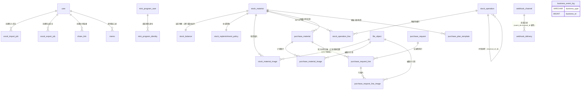

# 数据模型与表结构

MySQL 8.0 / InnoDB / `utf8mb4_0900_ai_ci`，共 **28 张表**，结构出自 `docs/references/database/init.sql`（结构与种子数据的唯一来源，仓库不提交增量迁移脚本）。

| 类型 | 字段 | 说明 |
| --- | --- | --- |
| `DECIMAL(18,1)` | `stock_operation_line.quantity/remaining_qty/before_qty/after_qty`、`stock_balance.quantity`、`planned_qty`、`purchase_qty`、`minimum_qty` | 业务数量统一 1 位小数 |
| `DECIMAL(18,2)` | `huaxing_inventory.quantity`、`lite_inventory.quantity` | 外部导入，保留原始精度 |
| `DATETIME(6)` | 所有时间字段 | UTC 语义，默认 `CURRENT_TIMESTAMP(6)`，写入侧由 `models/__init__.py` 的 `_utcnow()` 提供 |

`server/tests/test_init_sql.py` 比对 `init.sql` 与 ORM（`server/app/models/__init__.py`）的表集合、列集合、约束名、索引名、NULL 约束、ENUM 取值、外键及 `ON DELETE` 行为，两边必须完全一致。

<Tabs :tabs="[
  { id: 't0', title: '公共约定与表清单' },
  { id: 't1', title: '基础与平台表' },
  { id: 't2', title: '导入、分享与快照表' },
  { id: 't3', title: '申购单据与物资' },
  { id: 't4', title: '余额、策略、模板与图片' },
  { id: 't5', title: '申购记录行与库存流水行' },
  { id: 't6', title: '备忘表、关系与 ORM 对照' }
]">

<TabsContent id="t0">

### 公共字段约定

`AuditMixin` 提供 `created_at` / `updated_at`（`DATETIME(6) NOT NULL DEFAULT CURRENT_TIMESTAMP(6)`，`updated_at` 在 ORM 侧带 `onupdate`）与 `version`（`INT UNSIGNED NOT NULL DEFAULT 1`）。下表字段明细**不再重复列出审计列**，各表的审计列组合如下：

| 审计列组合 | 表 |
| --- | --- |
| `id` 自增 `BIGINT UNSIGNED`（主键）+ `created_at` + `updated_at` + `version` | `user`、`mini_program_user`、`mini_program_identity`、`webhook_channel`、`purchase_material`、`purchase_plan_template`、`purchase_request`、`purchase_request_line`、`stock_material`、`stock_operation`、`stock_operation_line`、`memo` |
| `id` = `VARCHAR(36)`（UUID 字符串）+ `created_at` + `updated_at` + `version` | `file_object` |
| `id` + `created_at` + `updated_at`（无 `version`） | `excel_import_job`、`excel_export_job`、`share_link`、`webhook_delivery` |
| `id` + `created_at`（无 `updated_at` / `version`） | `material_code_library`、`huaxing_inventory`、`lite_inventory` |
| 无 `id`，主键 `stock_material_id`（1:1 物资）+ `created_at` + `updated_at` + `version` | `stock_replenishment_policy` |
| 无 `id`，主键分别为 `stock_material_id`（1:1 物资）/ `setting_key`，+ `updated_at` + `version`（无 `created_at`） | `stock_balance`、`system_setting` |
| 无 `id`、无审计列，主键 = 父级列 + `file_id` | `stock_material_image`、`purchase_material_image`、`purchase_plan_template_image`、`purchase_request_line_image` |
| 只有 `id` + 业务时间 `occurred_at` | `business_event_log` |

| 审计列 | 出现范围 | 说明 |
| --- | --- | --- |
| `created_by` | `excel_import_job`、`excel_export_job`、`share_link`（可 NULL）、`memo`（NOT NULL，随用户删除级联） | 外键指向 `user.id` |
| `updated_by` | — | **全库没有该列** |
| 软删除列（`deleted_at` / `is_deleted`） | — | 不存在，删除均为物理删除 |
| 级联删除 | `stock_balance`、`stock_replenishment_policy`、图片关联表 | 随主表 `ON DELETE CASCADE` |

### 表清单（含 ORM 类名）

ORM 模型全部定义在 `server/app/models/__init__.py`（该目录下只有该文件）。

| 表名 | ORM 类名（`__tablename__` 同名） | 中文含义 | 所属域 |
| --- | --- | --- | --- |
| `user` | `User` | 管理端登录账号（含角色与接口令牌双列） | 用户 |
| `mini_program_user` | `MiniProgramUser` | 小程序用户档案 | 用户 |
| `mini_program_identity` | `MiniProgramIdentity` | 小程序用户与微信 OpenID 的绑定关系 | 用户 |
| `system_setting` | `SystemSetting` | 系统设置键值表 | 系统配置 |
| `business_event_log` | `BusinessEventLog` | 业务事件日志（状态流转与数据快照） | 系统配置 |
| `webhook_channel` | `WebhookChannel` | Webhook 渠道配置（飞书 / 钉钉） | Webhook |
| `webhook_delivery` | `WebhookDelivery` | Webhook 投递记录与重试状态 | Webhook |
| `file_object` | `FileObject` | 文件对象元数据（图片等） | 文件 |
| `excel_import_job` | `ExcelImportJob` | Excel 导入任务 | 导入导出 |
| `excel_export_job` | `ExcelExportJob` | Excel 导出任务（`file_uuid` 为派生属性，无独立列） | 导入导出 |
| `material_code_library` | `MaterialCodeLibrary` | 物资编码库（编码 / 名称 / 型号对照） | 导入导出 |
| `share_link` | `ShareLink` | 匿名分享链接 | 分享 |
| `stock_material` | `StockMaterial` | 二级库物资 | 二级库（完整模式） |
| `stock_balance` | `StockBalance` | 物资库存余额 | 二级库（完整模式） |
| `stock_replenishment_policy` | `StockReplenishmentPolicy` | 补库策略（最低库存阈值） | 二级库（完整模式） |
| `stock_operation` | `StockOperation` | 出入库单据头 | 二级库（完整模式） |
| `stock_operation_line` | `StockOperationLine` | 出入库单据明细行 | 二级库（完整模式） |
| `stock_material_image` | `StockMaterialImage` | 二级库物资图片关联 | 二级库（完整模式） |
| `lite_inventory` | `LiteInventory` | 精简二级库库存 | 二级库（精简模式） |
| `purchase_material` | `PurchaseMaterial` | 申购计划物资行 | 申购 |
| `purchase_material_image` | `PurchaseMaterialImage` | 申购计划图片关联 | 申购 |
| `purchase_plan_template` | `PurchasePlanTemplate` | 周期性申购计划模板 | 申购 |
| `purchase_plan_template_image` | `PurchasePlanTemplateImage` | 计划模板图片关联 | 申购 |
| `purchase_request` | `PurchaseRequest` | 申购记录头（订单 / 合同 / 船期等） | 申购 |
| `purchase_request_line` | `PurchaseRequestLine` | 申购记录物资行（含计划快照） | 申购 |
| `purchase_request_line_image` | `PurchaseRequestLineImage` | 申购记录行图片关联 | 申购 |
| `memo` | `Memo` | 个人备忘录 | 备忘 |
| `huaxing_inventory` | `HuaXingInventory` | 华兴库存（外部库存导入数据） | 华兴库存 |

`MiniProgramIdentity` 与 `SystemSetting` **未列入模型模块的 `__all__`**；`ExcelExportJob.file_uuid` 为派生属性，无独立列。

</TabsContent>

<TabsContent id="t1">

### 字段明细：基础与平台表

| 表 | 字段 | 类型 | NULL | 默认值 | 说明 |
| --- | --- | --- | --- | --- | --- |
| `user` | `id` | BIGINT UNSIGNED | 否 | 自增 | 主键 |
| `user` | `username` | VARCHAR(64) | 否 | 无 | 登录名，唯一 |
| `user` | `password_hash` | VARCHAR(255) | 否 | 无 | Argon2id 密码哈希 |
| `user` | `api_token_hash` | VARCHAR(64) | 否 | 无 | 接口令牌 SHA-256，唯一，用于认证查找 |
| `user` | `api_token_enc` | VARCHAR(512) | 否 | `''` | 接口令牌 Fernet 密文，供读取接口解密回显 |
| `user` | `display_name` | VARCHAR(128) | 否 | 无 | 显示名称 |
| `user` | `role` | ENUM('SUPER_ADMIN','WAREHOUSE_ADMIN','PURCHASE_ADMIN','READ_ONLY') | 否 | 无 | 角色，接口同名字符串 |
| `user` | `enabled` | TINYINT(1) | 否 | 1 | 账号是否启用 |
| `user` | *索引 / 外键* | — | — | — | 索引 `pk_user(id)`；唯一 `uq_user_username(username)`、`uq_user_api_token_hash(api_token_hash)`；外键：无 |
| `mini_program_user` | `id` | BIGINT UNSIGNED | 否 | 自增 | 主键 |
| `mini_program_user` | `display_name` | VARCHAR(128) | 否 | 无 | 姓名 |
| `mini_program_user` | `department_name` | VARCHAR(128) | 否 | `'华星检修维护部电气车间'` | 部门 |
| `mini_program_user` | `enabled` | TINYINT(1) | 否 | 1 | 是否允许使用小程序 |
| `mini_program_user` | *索引 / 外键* | — | — | — | 索引 `pk_mini_program_user(id)`；外键：无 |
| `mini_program_identity` | `id` | BIGINT UNSIGNED | 否 | 自增 | 主键 |
| `mini_program_identity` | `mini_program_user_id` | BIGINT UNSIGNED | 否 | 无 | 关联小程序用户 |
| `mini_program_identity` | `app_id` | VARCHAR(64) | 否 | 无 | 小程序 AppID |
| `mini_program_identity` | `wechat_openid` | VARCHAR(128) | 否 | 无 | 微信 OpenID |
| `mini_program_identity` | *索引 / 外键* | — | — | — | 索引 `pk_mini_program_identity(id)`；唯一 `uq_mini_program_identity_app_id(app_id, wechat_openid)`、`uq_mini_program_identity_mini_program_user_id(mini_program_user_id, app_id)`；外键 `mini_program_user_id → mini_program_user.id`，`ON DELETE CASCADE` |
| `system_setting` | `setting_key` | VARCHAR(64) | 否 | 无 | 设置键，主键 |
| `system_setting` | `setting_value` | JSON | 否 | 无 | 设置值（JSON 文档） |
| `system_setting` | *索引 / 外键* | — | — | — | 索引 `pk_system_setting(setting_key)`；外键：无 |
| `business_event_log` | `id` | BIGINT UNSIGNED | 否 | 自增 | 主键 |
| `business_event_log` | `business_type` | VARCHAR(64) | 否 | 无 | 业务类型标识 |
| `business_event_log` | `business_id` | BIGINT UNSIGNED | 否 | 无 | 业务主键（弱关联，无外键） |
| `business_event_log` | `action` | VARCHAR(64) | 否 | 无 | 动作标识 |
| `business_event_log` | `old_status` | VARCHAR(32) | 是 | NULL | 变更前状态 |
| `business_event_log` | `new_status` | VARCHAR(32) | 是 | NULL | 变更后状态 |
| `business_event_log` | `occurred_at` | DATETIME(6) | 否 | CURRENT_TIMESTAMP(6) | 事件发生时间 |
| `business_event_log` | `remark` | VARCHAR(1000) | 是 | NULL | 备注 |
| `business_event_log` | `before_data` | JSON | 是 | NULL | 变更前数据快照 |
| `business_event_log` | `after_data` | JSON | 是 | NULL | 变更后数据快照 |
| `business_event_log` | *索引 / 外键* | — | — | — | 索引 `pk_business_event_log(id)`、`ix_business_event_entity(business_type, business_id, id)`；外键：无 |
| `webhook_channel` | `id` | BIGINT UNSIGNED | 否 | 自增 | 主键 |
| `webhook_channel` | `platform` | ENUM('FEISHU','DINGTALK') | 否 | 无 | 渠道平台，唯一 |
| `webhook_channel` | `enabled` | TINYINT(1) | 否 | 0 | 是否启用该渠道 |
| `webhook_channel` | `webhook_url_encrypted` | VARCHAR(2000) | 否 | `''` | 加密后的 Webhook 地址 |
| `webhook_channel` | `secret_encrypted` | VARCHAR(2000) | 否 | `''` | 加密后的签名密钥 |
| `webhook_channel` | `subscribed_events` | JSON | 否 | 无 | 订阅事件名数组 |
| `webhook_channel` | *索引 / 外键* | — | — | — | 索引 `pk_webhook_channel(id)`；唯一 `uq_webhook_channel_platform(platform)`；外键：无 |
| `webhook_delivery` | `id` | BIGINT UNSIGNED | 否 | 自增 | 主键 |
| `webhook_delivery` | `event_id` | VARCHAR(36) | 否 | 无 | 事件 id（与 `channel_id` 组合唯一，幂等） |
| `webhook_delivery` | `event_type` | ENUM('STOCK_OUTBOUND_CREATED','STOCK_INBOUND_CREATED','MINI_PROGRAM_USER_BOUND') | 否 | 无 | 事件类型，接口值为 `stock.outbound.created` / `stock.inbound.created` / `mini_program.user.bound` |
| `webhook_delivery` | `channel_id` | BIGINT UNSIGNED | 否 | 无 | 目标渠道 |
| `webhook_delivery` | `payload` | JSON | 否 | 无 | 投递报文 |
| `webhook_delivery` | `status` | ENUM('PENDING','SENDING','SUCCEEDED','FAILED') | 否 | `'PENDING'` | 投递状态 |
| `webhook_delivery` | `attempts` | TINYINT UNSIGNED | 否 | 0 | 已尝试次数 |
| `webhook_delivery` | `next_retry_at` | DATETIME(6) | 否 | CURRENT_TIMESTAMP(6) | 下次重试时间 |
| `webhook_delivery` | `response_status` | INT | 是 | NULL | 响应 HTTP 状态码 |
| `webhook_delivery` | `response_excerpt` | VARCHAR(1000) | 是 | NULL | 响应摘录 |
| `webhook_delivery` | `last_error` | VARCHAR(1000) | 是 | NULL | 最近错误信息 |
| `webhook_delivery` | `delivered_at` | DATETIME(6) | 是 | NULL | 投递成功时间 |
| `webhook_delivery` | *索引 / 外键* | — | — | — | 索引 `pk_webhook_delivery(id)`；唯一 `uq_webhook_delivery_event_id(event_id, channel_id)`；`ix_webhook_delivery_pending(status, next_retry_at, id)`；外键 `channel_id → webhook_channel.id`（无 `ON DELETE` 子句，即 RESTRICT） |
| `file_object` | `id` | VARCHAR(36) | 否 | 无 | 主键，UUID 字符串（`uuid7_string`） |
| `file_object` | `original_name` | VARCHAR(255) | 否 | 无 | 原始文件名 |
| `file_object` | `mime_type` | VARCHAR(32) | 否 | 无 | MIME 类型 |
| `file_object` | `size_bytes` | BIGINT UNSIGNED | 否 | 无 | 文件字节数 |
| `file_object` | `width` | INT | 否 | 无 | 图片宽度 |
| `file_object` | `height` | INT | 否 | 无 | 图片高度 |
| `file_object` | `sha256` | VARCHAR(64) | 否 | 无 | 内容哈希（非唯一索引） |
| `file_object` | *索引 / 外键* | — | — | — | 索引 `pk_file_object(id)`、`ix_file_object_sha256(sha256)`；外键：无（由各图片关联表引用本表） |

</TabsContent>

<TabsContent id="t2">

### 字段明细：导入、分享与快照表

| 表 | 字段 | 类型 | NULL | 默认值 | 说明 |
| --- | --- | --- | --- | --- | --- |
| `excel_import_job` | `id` | BIGINT UNSIGNED | 否 | 自增 | 主键 |
| `excel_import_job` | `import_type` | VARCHAR(32) | 否 | 无 | 导入类型标识 |
| `excel_import_job` | `status` | ENUM('PENDING','RUNNING','SUCCEEDED','FAILED') | 否 | `'PENDING'` | 任务状态 |
| `excel_import_job` | `original_filename` | VARCHAR(255) | 否 | 无 | 上传文件名 |
| `excel_import_job` | `file_path` | VARCHAR(500) | 否 | 无 | 上传文件落盘路径 |
| `excel_import_job` | `result` | JSON | 是 | NULL | 导入结果统计 |
| `excel_import_job` | `error_code` | VARCHAR(64) | 是 | NULL | 错误码 |
| `excel_import_job` | `error_message` | VARCHAR(1000) | 是 | NULL | 错误信息 |
| `excel_import_job` | `created_by` | BIGINT UNSIGNED | 是 | NULL | 创建人 |
| `excel_import_job` | `started_at` | DATETIME(6) | 是 | NULL | 开始执行时间 |
| `excel_import_job` | `finished_at` | DATETIME(6) | 是 | NULL | 结束时间 |
| `excel_import_job` | *索引 / 外键* | — | — | — | 索引 `pk_excel_import_job(id)`、`ix_excel_import_job_type_status(import_type, status, id)`；外键 `created_by → user.id`（无 `ON DELETE` 子句，即 RESTRICT） |
| `excel_export_job` | `id` | BIGINT UNSIGNED | 否 | 自增 | 主键 |
| `excel_export_job` | `export_type` | VARCHAR(32) | 否 | 无 | 导出类型标识 |
| `excel_export_job` | `status` | ENUM('PENDING','RUNNING','SUCCEEDED','FAILED') | 否 | `'PENDING'` | 任务状态 |
| `excel_export_job` | `download_filename` | VARCHAR(255) | 是 | NULL | 下载文件名 |
| `excel_export_job` | `file_path` | VARCHAR(500) | 是 | NULL | 生成文件路径（成功保留至保留期） |
| `excel_export_job` | `params` | JSON | 是 | NULL | 导出参数快照 |
| `excel_export_job` | `result` | JSON | 是 | NULL | 导出结果统计 |
| `excel_export_job` | `error_code` | VARCHAR(64) | 是 | NULL | 错误码 |
| `excel_export_job` | `error_message` | VARCHAR(1000) | 是 | NULL | 错误信息 |
| `excel_export_job` | `created_by` | BIGINT UNSIGNED | 是 | NULL | 创建人 |
| `excel_export_job` | `started_at` | DATETIME(6) | 是 | NULL | 开始执行时间 |
| `excel_export_job` | `finished_at` | DATETIME(6) | 是 | NULL | 结束时间 |
| `excel_export_job` | *索引 / 外键* | — | — | — | 索引 `pk_excel_export_job(id)`、`ix_excel_export_job_type_status(export_type, status, id)`；外键 `created_by → user.id`（无 `ON DELETE` 子句，即 RESTRICT） |
| `material_code_library` | `id` | BIGINT UNSIGNED | 否 | 自增 | 主键 |
| `material_code_library` | `material_code` | VARCHAR(64) | 否 | 无 | 物资编码，唯一 |
| `material_code_library` | `name` | VARCHAR(128) | 是 | NULL | 名称 |
| `material_code_library` | `model_spec` | VARCHAR(255) | 是 | NULL | 型号规格 |
| `material_code_library` | `unit_name` | VARCHAR(32) | 否 | 无 | 单位 |
| `material_code_library` | *索引 / 外键* | — | — | — | 索引 `pk_material_code_library(id)`；唯一 `uq_material_code_library_material_code(material_code)`；外键：无 |
| `share_link` | `id` | BIGINT UNSIGNED | 否 | 自增 | 主键 |
| `share_link` | `token` | VARCHAR(36) | 否 | 无 | 分享令牌（UUID，唯一，不可猜解） |
| `share_link` | `share_type` | ENUM('PURCHASE_PLAN','PURCHASE_RECORD') | 否 | 无 | 分享数据类型，接口值为 `purchase_plan` / `purchase_record` |
| `share_link` | `item_ids` | JSON | 否 | 无 | 被分享数据行 id 数组（弱关联） |
| `share_link` | `columns` | JSON | 是 | NULL | 展示列键名数组；NULL 表示全部默认列 |
| `share_link` | `expires_at` | DATETIME(6) | 是 | NULL | 失效时间；NULL 表示永久有效 |
| `share_link` | `created_by` | BIGINT UNSIGNED | 是 | NULL | 创建人 |
| `share_link` | *索引 / 外键* | — | — | — | 索引 `pk_share_link(id)`；唯一 `uq_share_link_token(token)`；`ix_share_link_expires_at(expires_at)`、`ix_share_link_share_type(share_type)`；外键 `created_by → user.id`（无 `ON DELETE` 子句，即 RESTRICT） |
| `huaxing_inventory` | `id` | BIGINT UNSIGNED | 否 | 自增 | 主键 |
| `huaxing_inventory` | `first_inbound_date` | DATE | 是 | NULL | 首次入库日期 |
| `huaxing_inventory` | `warehouse` | VARCHAR(128) | 是 | NULL | 仓库 |
| `huaxing_inventory` | `material_code` | VARCHAR(64) | 是 | NULL | 物资编码 |
| `huaxing_inventory` | `name` | VARCHAR(255) | 是 | NULL | 名称 |
| `huaxing_inventory` | `model_spec` | VARCHAR(255) | 是 | NULL | 型号规格 |
| `huaxing_inventory` | `quantity` | DECIMAL(18, 2) | 是 | NULL | 数量（外部导入原始精度） |
| `huaxing_inventory` | `unit_name` | VARCHAR(32) | 是 | NULL | 单位 |
| `huaxing_inventory` | `purchaser` | VARCHAR(128) | 是 | NULL | 申购人 |
| `huaxing_inventory` | `purchase_department` | VARCHAR(128) | 是 | NULL | 申购部门 |
| `huaxing_inventory` | `subitem_no_name` | VARCHAR(255) | 是 | NULL | 子项号名称 |
| `huaxing_inventory` | *索引 / 外键* | — | — | — | 索引 `pk_huaxing_inventory(id)`；外键：无 |
| `lite_inventory` | `id` | BIGINT UNSIGNED | 否 | 自增 | 主键 |
| `lite_inventory` | `name` | VARCHAR(128) | 否 | 无 | 名称 |
| `lite_inventory` | `model_spec` | VARCHAR(255) | 是 | NULL | 型号规格 |
| `lite_inventory` | `unit_name` | VARCHAR(32) | 是 | NULL | 单位 |
| `lite_inventory` | `quantity` | DECIMAL(18, 2) | 是 | NULL | 数量（导入原始精度） |
| `lite_inventory` | `remark` | VARCHAR(1000) | 是 | NULL | 备注 |
| `lite_inventory` | *索引 / 外键* | — | — | — | 索引 `pk_lite_inventory(id)`；外键：无 |

</TabsContent>

<TabsContent id="t3">

### 字段明细：申购单据与物资

| 表 | 字段 | 类型 | NULL | 默认值 | 说明 |
| --- | --- | --- | --- | --- | --- |
| `purchase_request` | `id` | BIGINT UNSIGNED | 否 | 自增 | 主键 |
| `purchase_request` | `purchase_order_no` | VARCHAR(128) | 是 | NULL | 采购订单号 |
| `purchase_request` | `contract_no` | VARCHAR(128) | 是 | NULL | 合同号 |
| `purchase_request` | `vessel_no` | VARCHAR(128) | 是 | NULL | 船号 |
| `purchase_request` | `consolidation_date` | DATE | 是 | NULL | 集港日期 |
| `purchase_request` | `consolidation_port` | VARCHAR(128) | 是 | NULL | 集港港口 |
| `purchase_request` | `sailing_date` | DATE | 是 | NULL | 开船日期 |
| `purchase_request` | `remark` | VARCHAR(1000) | 是 | NULL | 备注 |
| `purchase_request` | `purchase_date` | DATE | 是 | NULL | 采购日期 |
| `purchase_request` | *索引 / 外键* | — | — | — | 索引 `pk_purchase_request(id)`；外键：无 |
| `stock_material` | `id` | BIGINT UNSIGNED | 否 | 自增 | 主键 |
| `stock_material` | `uuid` | VARCHAR(36) | 否 | 无 | 对外 UUID，唯一 |
| `stock_material` | `name` | VARCHAR(128) | 否 | 无 | 名称 |
| `stock_material` | `name_id` | VARCHAR(128) | 是 | NULL | 名称编号（别名索引） |
| `stock_material` | `alias` | VARCHAR(128) | 是 | NULL | 别名 |
| `stock_material` | `model_spec` | VARCHAR(255) | 否 | 无 | 型号规格 |
| `stock_material` | `unit_name` | VARCHAR(32) | 否 | 无 | 单位 |
| `stock_material` | `remark` | VARCHAR(1000) | 是 | NULL | 备注 |
| `stock_material` | `identity_hash` | VARCHAR(64) | 否 | 无 | 名称+型号+单位归一化哈希，唯一，用于去重 |
| `stock_material` | *索引 / 外键* | — | — | — | 索引 `pk_stock_material(id)`；唯一 `uq_stock_material_uuid(uuid)`、`uq_stock_material_identity_hash(identity_hash)`；外键：无 |
| `stock_operation` | `id` | BIGINT UNSIGNED | 否 | 自增 | 主键 |
| `stock_operation` | `operation_no` | VARCHAR(32) | 否 | 无 | 单据编号，唯一 |
| `stock_operation` | `operation_type` | ENUM('INBOUND','OUTBOUND') | 否 | 无 | 出入库方向 |
| `stock_operation` | `occurred_at` | DATETIME(6) | 否 | 无 | 业务发生时间（必填，无默认值） |
| `stock_operation` | `business_reason` | VARCHAR(500) | 否 | 无 | 业务原因 |
| `stock_operation` | `receiver_unit` | VARCHAR(128) | 是 | NULL | 领用单位 |
| `stock_operation` | `receiver_name` | VARCHAR(64) | 是 | NULL | 领用人 |
| `stock_operation` | `subitem_no` | VARCHAR(64) | 是 | NULL | 子项号 |
| `stock_operation` | `source_type` | ENUM('MANUAL','MINI_PROGRAM','REVERSAL','INITIALIZATION') | 否 | 无 | 来源：管理端/小程序/冲销/初始化 |
| `stock_operation` | `reversal_of_id` | BIGINT UNSIGNED | 是 | NULL | 被冲销单据（自引用） |
| `stock_operation` | `client_request_id` | VARCHAR(64) | 否 | 无 | 客户端请求 id，唯一，幂等键 |
| `stock_operation` | `mini_program_user_name_snapshot` | VARCHAR(128) | 是 | NULL | 小程序提交人姓名快照 |
| `stock_operation` | *索引 / 外键* | — | — | — | 索引 `pk_stock_operation(id)`；唯一 `uq_stock_operation_operation_no(operation_no)`、`uq_stock_operation_client_request_id(client_request_id)`；`ix_stock_operation_occurred_at(occurred_at)`、`ix_stock_operation_source_occurred(source_type, occurred_at)`、`ix_stock_operation_type_occurred(operation_type, occurred_at)`、`ix_stock_operation_reversal_of_id(reversal_of_id)`；外键 `reversal_of_id → stock_operation.id`（无 `ON DELETE` 子句，即 RESTRICT） |
| `purchase_material` | `id` | BIGINT UNSIGNED | 否 | 自增 | 主键 |
| `purchase_material` | `plan_no` | VARCHAR(32) | 否 | 无 | 计划编号，唯一 |
| `purchase_material` | `plan_date` | DATE | 否 | 无 | 计划日期 |
| `purchase_material` | `material_code` | VARCHAR(64) | 是 | NULL | 物资编码；NULL 即未编码 |
| `purchase_material` | `category` | VARCHAR(64) | 是 | NULL | 分类 |
| `purchase_material` | `urgency` | VARCHAR(32) | 否 | `'正常'` | 紧急程度 |
| `purchase_material` | `demand_department` | VARCHAR(128) | 否 | `'HXNI 检修维护部'` | 需求部门 |
| `purchase_material` | `name` | VARCHAR(128) | 否 | 无 | 名称 |
| `purchase_material` | `model_spec` | VARCHAR(255) | 否 | 无 | 型号规格 |
| `purchase_material` | `unit_name` | VARCHAR(32) | 否 | 无 | 单位 |
| `purchase_material` | `actual_demand_person` | VARCHAR(128) | 否 | 无 | 实际需求人 |
| `purchase_material` | `purchase_responsible` | VARCHAR(128) | 否 | 无 | 采购负责人 |
| `purchase_material` | `planned_qty` | DECIMAL(18, 1) | 否 | 无 | 计划数量 |
| `purchase_material` | `usage` | VARCHAR(500) | 否 | 无 | 用途 |
| `purchase_material` | `subitem_no` | VARCHAR(64) | 是 | NULL | 子项号 |
| `purchase_material` | `remark` | VARCHAR(1000) | 是 | NULL | 备注 |
| `purchase_material` | `stock_material_id` | BIGINT UNSIGNED | 是 | NULL | 关联二级库物资 |
| `purchase_material` | `status` | ENUM('NORMAL','DEFERRED','ARCHIVED') | 否 | `'NORMAL'` | 计划状态，接口序列化为 正常 / 暂不申购 / 已归档 |
| `purchase_material` | *索引 / 外键* | — | — | — | 索引 `pk_purchase_material(id)`；唯一 `uq_purchase_material_plan_no(plan_no)`；`ix_purchase_material_status(status)`、`ix_purchase_material_stock_material_id(stock_material_id)`；外键 `stock_material_id → stock_material.id`（无 `ON DELETE` 子句，即 RESTRICT） |

</TabsContent>

<TabsContent id="t4">

### 字段明细：余额、策略、模板与图片

| 表 | 字段 | 类型 | NULL | 默认值 | 说明 |
| --- | --- | --- | --- | --- | --- |
| `stock_balance` | `stock_material_id` | BIGINT UNSIGNED | 否 | 无 | 主键，1:1 关联物资 |
| `stock_balance` | `quantity` | DECIMAL(18, 1) | 否 | 0 | 当前余额 |
| `stock_balance` | *索引 / 外键* | — | — | — | 索引 `pk_stock_balance(stock_material_id)`；外键 `stock_material_id → stock_material.id`，`ON DELETE CASCADE` |
| `stock_material_image` | `material_id` | BIGINT UNSIGNED | 否 | 无 | 主键之一，关联物资 |
| `stock_material_image` | `file_id` | VARCHAR(36) | 否 | 无 | 主键之一，关联文件 |
| `stock_material_image` | `sort_order` | TINYINT UNSIGNED | 否 | 0 | 展示排序 |
| `stock_material_image` | *索引 / 外键* | — | — | — | 索引 `pk_stock_material_image(material_id, file_id)`；外键 `material_id → stock_material.id`（`ON DELETE CASCADE`）、`file_id → file_object.id`（无 `ON DELETE` 子句，即 RESTRICT） |
| `stock_replenishment_policy` | `stock_material_id` | BIGINT UNSIGNED | 否 | 无 | 主键，1:1 关联物资 |
| `stock_replenishment_policy` | `minimum_qty` | DECIMAL(18, 1) | 否 | 无 | 最低库存阈值，`CHECK (minimum_qty >= 0)` |
| `stock_replenishment_policy` | `enabled` | TINYINT(1) | 否 | 1 | 是否启用补库策略 |
| `stock_replenishment_policy` | *索引 / 外键* | — | — | — | 索引 `pk_stock_replenishment_policy(stock_material_id)`；检查约束 `ck_stock_replenishment_policy_minimum_nonnegative`；外键 `stock_material_id → stock_material.id`，`ON DELETE CASCADE` |
| `purchase_material_image` | `material_id` | BIGINT UNSIGNED | 否 | 无 | 主键之一，关联申购计划 |
| `purchase_material_image` | `file_id` | VARCHAR(36) | 否 | 无 | 主键之一，关联文件 |
| `purchase_material_image` | `sort_order` | TINYINT UNSIGNED | 否 | 0 | 展示排序 |
| `purchase_material_image` | *索引 / 外键* | — | — | — | 索引 `pk_purchase_material_image(material_id, file_id)`；外键 `material_id → purchase_material.id`（`ON DELETE CASCADE`）、`file_id → file_object.id`（无 `ON DELETE` 子句，即 RESTRICT） |
| `purchase_plan_template` | `id` | BIGINT UNSIGNED | 否 | 自增 | 主键 |
| `purchase_plan_template` | `material_code` | VARCHAR(64) | 是 | NULL | 物资编码；NULL 即未编码 |
| `purchase_plan_template` | `category` | VARCHAR(64) | 是 | NULL | 分类 |
| `purchase_plan_template` | `urgency` | VARCHAR(32) | 否 | `'正常'` | 紧急程度 |
| `purchase_plan_template` | `demand_department` | VARCHAR(128) | 否 | `'HXNI 检修维护部'` | 需求部门 |
| `purchase_plan_template` | `name` | VARCHAR(128) | 否 | 无 | 名称 |
| `purchase_plan_template` | `model_spec` | VARCHAR(255) | 否 | 无 | 型号规格 |
| `purchase_plan_template` | `unit_name` | VARCHAR(32) | 否 | 无 | 单位 |
| `purchase_plan_template` | `actual_demand_person` | VARCHAR(128) | 否 | 无 | 实际需求人 |
| `purchase_plan_template` | `purchase_responsible` | VARCHAR(128) | 否 | 无 | 采购负责人 |
| `purchase_plan_template` | `planned_qty` | DECIMAL(18, 1) | 否 | 无 | 计划数量 |
| `purchase_plan_template` | `usage` | VARCHAR(500) | 否 | 无 | 用途 |
| `purchase_plan_template` | `subitem_no` | VARCHAR(64) | 是 | NULL | 子项号 |
| `purchase_plan_template` | `remark` | VARCHAR(1000) | 是 | NULL | 备注 |
| `purchase_plan_template` | `stock_material_id` | BIGINT UNSIGNED | 是 | NULL | 关联二级库物资 |
| `purchase_plan_template` | *索引 / 外键* | — | — | — | 索引 `pk_purchase_plan_template(id)`、`ix_purchase_plan_template_stock_material_id(stock_material_id)`；外键 `stock_material_id → stock_material.id`（无 `ON DELETE` 子句，即 RESTRICT） |
| `purchase_plan_template_image` | `plan_id` | BIGINT UNSIGNED | 否 | 无 | 主键之一，关联计划模板 |
| `purchase_plan_template_image` | `file_id` | VARCHAR(36) | 否 | 无 | 主键之一，关联文件 |
| `purchase_plan_template_image` | `sort_order` | TINYINT UNSIGNED | 否 | 0 | 展示排序 |
| `purchase_plan_template_image` | *索引 / 外键* | — | — | — | 索引 `pk_purchase_plan_template_image(plan_id, file_id)`；外键 `plan_id → purchase_plan_template.id`（`ON DELETE CASCADE`）、`file_id → file_object.id`（无 `ON DELETE` 子句，即 RESTRICT） |

</TabsContent>

<TabsContent id="t5">

### 字段明细：申购记录行与库存流水行

| 表 | 字段 | 类型 | NULL | 默认值 | 说明 |
| --- | --- | --- | --- | --- | --- |
| `purchase_request_line` | `id` | BIGINT UNSIGNED | 否 | 自增 | 主键 |
| `purchase_request_line` | `purchase_request_id` | BIGINT UNSIGNED | 否 | 无 | 所属申购记录头 |
| `purchase_request_line` | `purchase_material_id` | BIGINT UNSIGNED | 是 | NULL | 来源申购计划（计划删除后置空） |
| `purchase_request_line` | `plan_no_snapshot` | VARCHAR(32) | 否 | 无 | 计划编号快照 |
| `purchase_request_line` | `plan_date_snapshot` | DATE | 否 | 无 | 计划日期快照 |
| `purchase_request_line` | `material_code_snapshot` | VARCHAR(64) | 是 | NULL | 物资编码快照；NULL 即未编码 |
| `purchase_request_line` | `category_snapshot` | VARCHAR(64) | 是 | NULL | 分类快照 |
| `purchase_request_line` | `demand_department_snapshot` | VARCHAR(128) | 否 | 无 | 需求部门快照 |
| `purchase_request_line` | `material_name_snapshot` | VARCHAR(128) | 否 | 无 | 名称快照 |
| `purchase_request_line` | `model_spec_snapshot` | VARCHAR(255) | 否 | 无 | 型号规格快照 |
| `purchase_request_line` | `unit_name_snapshot` | VARCHAR(32) | 否 | 无 | 单位快照 |
| `purchase_request_line` | `actual_demand_person_snapshot` | VARCHAR(128) | 否 | 无 | 实际需求人快照 |
| `purchase_request_line` | `purchase_responsible_snapshot` | VARCHAR(128) | 否 | 无 | 采购负责人快照 |
| `purchase_request_line` | `plan_remark_snapshot` | VARCHAR(1000) | 是 | NULL | 计划备注快照 |
| `purchase_request_line` | `stock_material_id_snapshot` | BIGINT UNSIGNED | 是 | NULL | 关联二级库物资 id 快照（无外键） |
| `purchase_request_line` | `purchase_qty` | DECIMAL(18, 1) | 否 | 无 | 申购数量，`CHECK (purchase_qty > 0)` |
| `purchase_request_line` | `status` | VARCHAR(128) | 否 | `'已申购'` | 申购状态文本（普通字符串列，非 ENUM） |
| `purchase_request_line` | `usage` | VARCHAR(500) | 否 | 无 | 用途 |
| `purchase_request_line` | `usage_hash` | VARCHAR(32) | 否 | 无 | `usage` 的 SHA-256 前 32 位，参与唯一键 |
| `purchase_request_line` | `subitem_no` | VARCHAR(64) | 是 | NULL | 子项号 |
| `purchase_request_line` | `trace_no` | VARCHAR(128) | 是 | NULL | 追溯号 |
| `purchase_request_line` | `salesperson` | VARCHAR(128) | 是 | NULL | 业务员 |
| `purchase_request_line` | `contract_sign_date` | DATE | 是 | NULL | 合同签订日期（物资级） |
| `purchase_request_line` | *索引 / 外键* | — | — | — | 索引 `pk_purchase_request_line(id)`；唯一 `uq_purchase_request_line_purchase_request_id(purchase_request_id, purchase_material_id, subitem_no, usage_hash)`；`ix_purchase_request_line_trace_no(trace_no)`；检查约束 `ck_purchase_request_line_purchase_positive`；外键 `purchase_request_id → purchase_request.id`（`ON DELETE CASCADE`）、`purchase_material_id → purchase_material.id`（`ON DELETE SET NULL`） |
| `purchase_request_line_image` | `line_id` | BIGINT UNSIGNED | 否 | 无 | 主键之一，关联申购记录行 |
| `purchase_request_line_image` | `file_id` | VARCHAR(36) | 否 | 无 | 主键之一，关联文件 |
| `purchase_request_line_image` | `sort_order` | TINYINT UNSIGNED | 否 | 0 | 展示排序 |
| `purchase_request_line_image` | *索引 / 外键* | — | — | — | 索引 `pk_purchase_request_line_image(line_id, file_id)`；外键 `line_id → purchase_request_line.id`（`ON DELETE CASCADE`）、`file_id → file_object.id`（无 `ON DELETE` 子句，即 RESTRICT） |
| `stock_operation_line` | `id` | BIGINT UNSIGNED | 否 | 自增 | 主键 |
| `stock_operation_line` | `operation_id` | BIGINT UNSIGNED | 否 | 无 | 所属单据头 |
| `stock_operation_line` | `stock_material_id` | BIGINT UNSIGNED | 否 | 无 | 物资（与 `operation_id` 组合唯一） |
| `stock_operation_line` | `quantity` | DECIMAL(18, 1) | 否 | 无 | 本次数量，`CHECK (quantity > 0)` |
| `stock_operation_line` | `remaining_qty` | DECIMAL(18, 1) | 否 | 无 | 剩余可冲销数量 |
| `stock_operation_line` | `before_qty` | DECIMAL(18, 1) | 否 | 无 | 操作前余额 |
| `stock_operation_line` | `after_qty` | DECIMAL(18, 1) | 否 | 无 | 操作后余额 |
| `stock_operation_line` | `material_name_snapshot` | VARCHAR(128) | 否 | 无 | 名称快照 |
| `stock_operation_line` | `model_spec_snapshot` | VARCHAR(255) | 否 | 无 | 型号规格快照 |
| `stock_operation_line` | `unit_name_snapshot` | VARCHAR(32) | 否 | 无 | 单位快照 |
| `stock_operation_line` | *索引 / 外键* | — | — | — | 索引 `pk_stock_operation_line(id)`；唯一 `uq_stock_operation_line_operation_id(operation_id, stock_material_id)`；`ix_operation_line_material_operation(stock_material_id, operation_id)`；检查约束 `ck_stock_operation_line_operation_quantity_positive`；外键 `operation_id → stock_operation.id`（`ON DELETE CASCADE`）、`stock_material_id → stock_material.id`（无 `ON DELETE` 子句，即 RESTRICT） |

</TabsContent>

<TabsContent id="t6">

### 字段明细：备忘表

| 表 | 字段 | 类型 | NULL | 默认值 | 说明 |
| --- | --- | --- | --- | --- | --- |
| `memo` | `id` | BIGINT UNSIGNED | 否 | 自增 | 主键 |
| `memo` | `title` | VARCHAR(64) | 否 | `'未命名备忘录'` | 标题 |
| `memo` | `content` | TEXT | 否 | 无 | 正文纯文本 |
| `memo` | `created_by` | BIGINT UNSIGNED | 否 | 无 | 归属用户（不可为空） |
| `memo` | *索引 / 外键* | — | — | — | 索引 `pk_memo(id)`、`ix_memo_created_by(created_by)`；外键 `created_by → user.id`，`ON DELETE CASCADE` |

### 表关系

`business_event_log` 无外键：`business_type` + `business_id` 弱关联任意业务表，仅靠 `ix_business_event_entity` 检索。

### 约定与约束
| 约定 | 说明 |
| --- | --- |
| 余额是查询加速数据 | `stock_balance.quantity` 由出入库事务内基于 `before_qty` / `after_qty` 维护（`server/app/services/inventory_service.py`）并递增 `version`；`/api/v1/inventory/balances` 只有 GET，不存在直接改余额的写接口 |
| `stock_operation_line` 唯一约束 | `(operation_id, stock_material_id)`（即 `stock_operation_line.stock_material_id` 与单头组合唯一）：一张单据内同一物资只能一行；`quantity > 0` 由 `CHECK` 保证，方向由单据头 `operation_type` 表达 |
| `remaining_qty` 与冲销 | 冲销数量不得超过明细行 `remaining_qty`（`inventory_service`）；冲销单以 `source_type='REVERSAL'` + `reversal_of_id` 指向原单 |
| `stock_operation.client_request_id` 幂等 | 唯一索引保证同一客户端请求只落一张单据，重复提交返回既有单据 |
| `version` 乐观锁 | 更新前校验版本（`server/app/services/common.py` 的 `validate_version`），冲突按 [API 错误与状态码约定](/api-error-conventions) 返回 |
| `identity_hash` | `stock_material.identity_hash` = `name` + `model_spec` + `unit_name` 归一化后的 SHA-256（`server/app/services/common.py` 的 `identity_hash`），唯一索引用于物资去重 |
| `material_code IS NULL` 即未编码 | `purchase_material.material_code`、`purchase_plan_template.material_code`、`purchase_request_line.material_code_snapshot` 均以 NULL 表示未编码，无独立状态字段；筛选即 `is_(None)` / `is_not(None)`（`server/app/services/material_service.py`） |
| `enabled` 语义 | `user.enabled` 控制账号登录；`webhook_channel.enabled` 默认 0，启用时必须至少订阅一个事件；`stock_replenishment_policy.enabled` 默认 1 并参与低库存判定；`mini_program_user.enabled` 控制小程序可用性 |
| 敏感凭证回显 | `user.api_token_hash` 仅用于认证查找，`user.api_token_enc` 为可逆密文用于界面回显；`webhook_channel.webhook_url_encrypted` / `secret_encrypted` 同样加密存储、读取解密回显 |
| 快照字段不可回查 | `purchase_request_line.*_snapshot` 与 `stock_operation_line.*_snapshot` 在业务发生时写入，读取不依赖主数据表，主数据改名或清理后记录仍可读 |
| JSON 列 | `system_setting.setting_value`、`webhook_channel.subscribed_events`、`webhook_delivery.payload`、`excel_import_job.result`、`excel_export_job.params` / `result`、`share_link.item_ids` / `columns`、`business_event_log.before_data` / `after_data` 为 MySQL `JSON` 类型，不建额外索引 |
| 默认值差异 | `memo.content` 在 `init.sql` 无 `DEFAULT`，ORM 侧另有 `default=""` / `server_default=""`；`file_object.mime_type` 同样只在 ORM 侧有 `default="image/png"`（`test_init_sql.py` 不校验默认值） |
| DDL 导入与变更 | `init.sql` 不创建数据库与账号、不由业务容器自动执行，需部署方手工导入，导入期间临时 `SET FOREIGN_KEY_CHECKS = 0`；当前不存在增量迁移脚本、软删除列、`updated_by` 列与数据库分区/视图，表结构变更必须同时改 `init.sql` 与 ORM 模型 |

### 种子数据
`init.sql` 末尾只有一段 `INSERT`，插入 `user` 表 4 个初始账号（口令哈希相同，默认密码 123456，重复导入不会重置已有账号密码，语句带 `ON DUPLICATE KEY UPDATE display_name/role/enabled`）：

| `username` | `display_name` | `role` | `enabled` | `api_token_hash` |
| --- | --- | --- | --- | --- |
| `admin` | 系统管理员 | `SUPER_ADMIN` | 1 | `SHA2(@admin_api_token, 256)` |
| `warehouse` | 仓库管理员 | `WAREHOUSE_ADMIN` | 1 | `SHA2(@warehouse_api_token, 256)` |
| `purchase` | 申购管理员 | `PURCHASE_ADMIN` | 1 | `SHA2(@purchase_api_token, 256)` |
| `readonly` | 只读用户 | `READ_ONLY` | 1 | `SHA2(@readonly_api_token, 256)` |

四个接口令牌由 `RANDOM_BYTES` 生成的 UUID v4 形式字符串经 `SHA2(..., 256)` 计算后写入 `api_token_hash`；`api_token_enc` 未在种子语句中赋值，取默认空串，首次用令牌通过认证后被加密回写（`server/app/core/permissions.py`）。其余 27 张表当前不含种子数据，由运行期接口或导入任务写入。

命名与约束由 `server/app/core/database.py` 的 `NAMING_CONVENTION` 统一下发，ORM 不必手写名字：

| ORM 写法 | 生成的约束名 | 对应 `init.sql` |
| --- | --- | --- |
| 主键 | `pk_%(table_name)s` | `PRIMARY KEY` |
| `UniqueConstraint(...)` | `uq_%(table_name)s_%(column_0_name)s` | `UNIQUE KEY`，如 `uq_stock_operation_line_operation_id` |
| `CheckConstraint(..., name="minimum_nonnegative")` | `ck_%(table_name)s_%(constraint_name)s` | `CHECK`，如 `ck_stock_replenishment_policy_minimum_nonnegative` |
| `Index(...)` / `mapped_column(..., index=True)` | `ix_%(column_0_label)s` | `INDEX` 行，名字一致 |
| `ForeignKey(..., ondelete="CASCADE")` | `fk_%(table_name)s_%(column_0_name)s_%(referred_table_name)s` | 对应 `ON DELETE`；未写 `ondelete` 则 `init.sql` 中同样没有该子句 |

`server/tests/test_init_sql.py::test_init_sql_matches_current_model_schema` 逐表比对上述内容。

相关页面：[/dev-overview](/dev-overview)、[/dev-state-machines](/dev-state-machines)、[/dev-flows](/dev-flows)、[/dev-backend](/dev-backend)、[/api-error-conventions](/api-error-conventions)

</TabsContent>

</Tabs>
