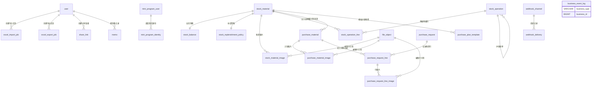

# 数据模型与表结构

数据库为 **MySQL 8.0 / InnoDB / utf8mb4（`utf8mb4_0900_ai_ci`）**，共 **28 张表**，全部结构出自 `docs/references/database/init.sql`（结构与种子数据的唯一来源，仓库不提交任何增量迁移脚本）。

数量字段以 `DECIMAL(18,1)` 为主（`stock_operation_line.quantity/remaining_qty/before_qty/after_qty`、`stock_balance.quantity`、`planned_qty`、`purchase_qty`、`minimum_qty`）；仅外部导入的 `huaxing_inventory.quantity` 与 `lite_inventory.quantity` 为 `DECIMAL(18,2)`。时间为 UTC 语义的 `DATETIME(6)`，默认 `CURRENT_TIMESTAMP(6)`，写入侧由 `server/app/models/__init__.py` 的 `_utcnow()` 提供。

`server/tests/test_init_sql.py` 比对 `init.sql` 与 ORM（`server/app/models/__init__.py`）的表集合、列集合、约束名、索引名、NULL 约束、ENUM 取值、外键及 `ON DELETE` 行为，两边必须完全一致。字段清单、类型、枚举、索引与外键以本页为准即可，与 ORM 模型的逐类对应见下文「ORM 模型 ↔ 表名对照」小节。

按表的分组切换；字段明细按 `init.sql` 定义顺序排列。

<Tabs :tabs="[
  { id: 't0', title: '公共约定与表清单' },
  { id: 't1', title: '基础与平台表' },
  { id: 't2', title: '导入、分享与快照表' },
  { id: 't3', title: '申购单据与物资' },
  { id: 't4', title: '余额、策略、模板与图片' },
  { id: 't5', title: '申购记录行与库存流水行' },
  { id: 't6', title: '备忘表、关系与 ORM 对照' }
]">

<TabsContent id="t0">

### 公共字段约定

- `AuditMixin` 提供 `created_at` / `updated_at`（`DATETIME(6) NOT NULL DEFAULT CURRENT_TIMESTAMP(6)`）与 `version`（`INT UNSIGNED NOT NULL DEFAULT 1`）；`updated_at` 在 ORM 侧带 `onupdate`。
- 同时具备 `id`（自增 `BIGINT UNSIGNED`）+ `created_at` + `updated_at` + `version`：`user`、`mini_program_user`、`mini_program_identity`、`webhook_channel`、`purchase_material`、`purchase_plan_template`、`purchase_request`、`purchase_request_line`、`stock_material`、`stock_operation`、`stock_operation_line`、`memo`。
- `file_object` 的 `id` 是 `VARCHAR(36)`（UUID 字符串）而非自增整数，其余审计列同上。
- `id` 之外的 `version` 差异：`excel_import_job`、`excel_export_job`、`share_link`、`webhook_delivery` 只有 `created_at` / `updated_at`（无 `version`）；`material_code_library`、`huaxing_inventory`、`lite_inventory` 只有 `created_at`。
- 无自增 `id` 的表：`stock_balance`（主键 `stock_material_id`，1:1）、`stock_replenishment_policy`（主键 `stock_material_id`，1:1）、`system_setting`（主键 `setting_key`）、`stock_material_image`（主键 `material_id + file_id`）、`purchase_material_image` / `purchase_plan_template_image` / `purchase_request_line_image`（主键 `父级 id + file_id`）。
- 无 `created_at` 的表：`stock_balance`、`stock_replenishment_policy` 之外的上述关联表（`stock_material_image`、`purchase_material_image`、`purchase_plan_template_image`、`purchase_request_line_image`）连 `updated_at` / `version` 也没有。
- `business_event_log` 只有 `id` 与业务时间 `occurred_at`，无 `created_at` / `updated_at` / `version`。
- `created_by`（`BIGINT UNSIGNED`，外键指向 `user.id`）只出现在 `excel_import_job`、`excel_export_job`、`share_link`（三者可为 NULL）与 `memo`（`NOT NULL`，随用户删除级联）上；**全库不存在 `updated_by` 列**。
- 全库不存在软删除列（如 `deleted_at` / `is_deleted`），删除均为物理删除；`stock_balance`、`stock_replenishment_policy`、图片关联表随主表 `ON DELETE CASCADE`。

### 表清单

| 表名 | 中文含义 | 所属域 |
| --- | --- | --- |
| `user` | 管理端登录账号（含角色与接口令牌） | 用户 |
| `mini_program_user` | 小程序用户档案 | 用户 |
| `mini_program_identity` | 小程序用户与微信 OpenID 的绑定关系 | 用户 |
| `system_setting` | 系统设置键值表 | 系统配置 |
| `business_event_log` | 业务事件日志（状态流转与数据快照） | 系统配置 |
| `webhook_channel` | Webhook 渠道配置（飞书 / 钉钉） | Webhook |
| `webhook_delivery` | Webhook 投递记录与重试状态 | Webhook |
| `file_object` | 文件对象元数据（图片等） | 文件 |
| `excel_import_job` | Excel 导入任务 | 导入导出 |
| `excel_export_job` | Excel 导出任务 | 导入导出 |
| `material_code_library` | 物资编码库（编码 / 名称 / 型号对照） | 导入导出 |
| `share_link` | 匿名分享链接 | 分享 |
| `stock_material` | 二级库物资 | 二级库（完整模式） |
| `stock_balance` | 物资库存余额 | 二级库（完整模式） |
| `stock_replenishment_policy` | 补库策略（最低库存阈值） | 二级库（完整模式） |
| `stock_operation` | 出入库单据头 | 二级库（完整模式） |
| `stock_operation_line` | 出入库单据明细行 | 二级库（完整模式） |
| `stock_material_image` | 二级库物资图片关联 | 二级库（完整模式） |
| `lite_inventory` | 精简二级库库存 | 二级库（精简模式） |
| `purchase_material` | 申购计划物资行 | 申购 |
| `purchase_plan_template` | 周期性申购计划模板 | 申购 |
| `purchase_request` | 申购记录头（订单 / 合同 / 船期等） | 申购 |
| `purchase_request_line` | 申购记录物资行（含计划快照） | 申购 |
| `purchase_material_image` | 申购计划图片关联 | 申购 |
| `purchase_plan_template_image` | 计划模板图片关联 | 申购 |
| `purchase_request_line_image` | 申购记录行图片关联 | 申购 |
| `memo` | 个人备忘录 | 备忘 |
| `huaxing_inventory` | 华兴库存（外部库存导入数据） | 华兴库存 |

### 字段明细

</TabsContent>

<TabsContent id="t1">

#### `user`
| 字段名 | 类型 | NULL | 默认值 | 说明 |
| --- | --- | --- | --- | --- |
| `id` | BIGINT UNSIGNED | 否 | 自增 | 主键 |
| `username` | VARCHAR(64) | 否 | 无 | 登录名，唯一 |
| `password_hash` | VARCHAR(255) | 否 | 无 | Argon2id 密码哈希 |
| `api_token_hash` | VARCHAR(64) | 否 | 无 | 接口令牌 SHA-256，唯一，用于认证查找 |
| `api_token_enc` | VARCHAR(512) | 否 | `''` | 接口令牌 Fernet 密文，供读取接口解密回显 |
| `display_name` | VARCHAR(128) | 否 | 无 | 显示名称 |
| `role` | ENUM('SUPER_ADMIN','WAREHOUSE_ADMIN','PURCHASE_ADMIN','READ_ONLY') | 否 | 无 | 角色，接口同名字符串 |
| `enabled` | TINYINT(1) | 否 | 1 | 账号是否启用 |
| `created_at` | DATETIME(6) | 否 | CURRENT_TIMESTAMP(6) | 创建时间 |
| `updated_at` | DATETIME(6) | 否 | CURRENT_TIMESTAMP(6) | 更新时间 |
| `version` | INT UNSIGNED | 否 | 1 | 乐观锁版本 |
索引：`pk_user(id)`；唯一 `uq_user_username(username)`、`uq_user_api_token_hash(api_token_hash)`。外键：无。

#### `mini_program_user`
| 字段名 | 类型 | NULL | 默认值 | 说明 |
| --- | --- | --- | --- | --- |
| `id` | BIGINT UNSIGNED | 否 | 自增 | 主键 |
| `display_name` | VARCHAR(128) | 否 | 无 | 姓名 |
| `department_name` | VARCHAR(128) | 否 | `'华星检修维护部电气车间'` | 部门 |
| `enabled` | TINYINT(1) | 否 | 1 | 是否允许使用小程序 |
| `created_at` | DATETIME(6) | 否 | CURRENT_TIMESTAMP(6) | 创建时间 |
| `updated_at` | DATETIME(6) | 否 | CURRENT_TIMESTAMP(6) | 更新时间 |
| `version` | INT UNSIGNED | 否 | 1 | 乐观锁版本 |
索引：`pk_mini_program_user(id)`。外键：无。

#### `mini_program_identity`
| 字段名 | 类型 | NULL | 默认值 | 说明 |
| --- | --- | --- | --- | --- |
| `id` | BIGINT UNSIGNED | 否 | 自增 | 主键 |
| `mini_program_user_id` | BIGINT UNSIGNED | 否 | 无 | 关联小程序用户 |
| `app_id` | VARCHAR(64) | 否 | 无 | 小程序 AppID |
| `wechat_openid` | VARCHAR(128) | 否 | 无 | 微信 OpenID |
| `created_at` | DATETIME(6) | 否 | CURRENT_TIMESTAMP(6) | 创建时间 |
| `updated_at` | DATETIME(6) | 否 | CURRENT_TIMESTAMP(6) | 更新时间 |
| `version` | INT UNSIGNED | 否 | 1 | 乐观锁版本 |
索引：`pk_mini_program_identity(id)`；唯一 `uq_mini_program_identity_app_id(app_id, wechat_openid)`、`uq_mini_program_identity_mini_program_user_id(mini_program_user_id, app_id)`。外键：`mini_program_user_id → mini_program_user.id`，`ON DELETE CASCADE`。

#### `system_setting`
| 字段名 | 类型 | NULL | 默认值 | 说明 |
| --- | --- | --- | --- | --- |
| `setting_key` | VARCHAR(64) | 否 | 无 | 设置键，主键 |
| `setting_value` | JSON | 否 | 无 | 设置值（JSON 文档） |
| `version` | INT UNSIGNED | 否 | 1 | 乐观锁版本 |
| `updated_at` | DATETIME(6) | 否 | CURRENT_TIMESTAMP(6) | 更新时间（无 `created_at`） |
索引：`pk_system_setting(setting_key)`。外键：无。

#### `business_event_log`
| 字段名 | 类型 | NULL | 默认值 | 说明 |
| --- | --- | --- | --- | --- |
| `id` | BIGINT UNSIGNED | 否 | 自增 | 主键 |
| `business_type` | VARCHAR(64) | 否 | 无 | 业务类型标识 |
| `business_id` | BIGINT UNSIGNED | 否 | 无 | 业务主键（弱关联，无外键） |
| `action` | VARCHAR(64) | 否 | 无 | 动作标识 |
| `old_status` | VARCHAR(32) | 是 | NULL | 变更前状态 |
| `new_status` | VARCHAR(32) | 是 | NULL | 变更后状态 |
| `occurred_at` | DATETIME(6) | 否 | CURRENT_TIMESTAMP(6) | 事件发生时间 |
| `remark` | VARCHAR(1000) | 是 | NULL | 备注 |
| `before_data` | JSON | 是 | NULL | 变更前数据快照 |
| `after_data` | JSON | 是 | NULL | 变更后数据快照 |
索引：`pk_business_event_log(id)`、`ix_business_event_entity(business_type, business_id, id)`。外键：无。

#### `webhook_channel`
| 字段名 | 类型 | NULL | 默认值 | 说明 |
| --- | --- | --- | --- | --- |
| `id` | BIGINT UNSIGNED | 否 | 自增 | 主键 |
| `platform` | ENUM('FEISHU','DINGTALK') | 否 | 无 | 渠道平台，唯一 |
| `enabled` | TINYINT(1) | 否 | 0 | 是否启用该渠道 |
| `webhook_url_encrypted` | VARCHAR(2000) | 否 | `''` | 加密后的 Webhook 地址 |
| `secret_encrypted` | VARCHAR(2000) | 否 | `''` | 加密后的签名密钥 |
| `subscribed_events` | JSON | 否 | 无 | 订阅事件名数组 |
| `created_at` | DATETIME(6) | 否 | CURRENT_TIMESTAMP(6) | 创建时间 |
| `updated_at` | DATETIME(6) | 否 | CURRENT_TIMESTAMP(6) | 更新时间 |
| `version` | INT UNSIGNED | 否 | 1 | 乐观锁版本 |
索引：`pk_webhook_channel(id)`；唯一 `uq_webhook_channel_platform(platform)`。外键：无。

#### `webhook_delivery`
| 字段名 | 类型 | NULL | 默认值 | 说明 |
| --- | --- | --- | --- | --- |
| `id` | BIGINT UNSIGNED | 否 | 自增 | 主键 |
| `event_id` | VARCHAR(36) | 否 | 无 | 事件 id（与 `channel_id` 组合唯一，幂等） |
| `event_type` | ENUM('STOCK_OUTBOUND_CREATED','STOCK_INBOUND_CREATED','MINI_PROGRAM_USER_BOUND') | 否 | 无 | 事件类型，接口值为 `stock.outbound.created` / `stock.inbound.created` / `mini_program.user.bound` |
| `channel_id` | BIGINT UNSIGNED | 否 | 无 | 目标渠道 |
| `payload` | JSON | 否 | 无 | 投递报文 |
| `status` | ENUM('PENDING','SENDING','SUCCEEDED','FAILED') | 否 | `'PENDING'` | 投递状态 |
| `attempts` | TINYINT UNSIGNED | 否 | 0 | 已尝试次数 |
| `next_retry_at` | DATETIME(6) | 否 | CURRENT_TIMESTAMP(6) | 下次重试时间 |
| `response_status` | INT | 是 | NULL | 响应 HTTP 状态码 |
| `response_excerpt` | VARCHAR(1000) | 是 | NULL | 响应摘录 |
| `last_error` | VARCHAR(1000) | 是 | NULL | 最近错误信息 |
| `created_at` | DATETIME(6) | 否 | CURRENT_TIMESTAMP(6) | 创建时间 |
| `updated_at` | DATETIME(6) | 否 | CURRENT_TIMESTAMP(6) | 更新时间 |
| `delivered_at` | DATETIME(6) | 是 | NULL | 投递成功时间 |
索引：`pk_webhook_delivery(id)`；唯一 `uq_webhook_delivery_event_id(event_id, channel_id)`；`ix_webhook_delivery_pending(status, next_retry_at, id)`。外键：`channel_id → webhook_channel.id`（无 `ON DELETE` 子句，即 RESTRICT）。

#### `file_object`
| 字段名 | 类型 | NULL | 默认值 | 说明 |
| --- | --- | --- | --- | --- |
| `id` | VARCHAR(36) | 否 | 无 | 主键，UUID 字符串（`uuid7_string`） |
| `original_name` | VARCHAR(255) | 否 | 无 | 原始文件名 |
| `mime_type` | VARCHAR(32) | 否 | 无 | MIME 类型 |
| `size_bytes` | BIGINT UNSIGNED | 否 | 无 | 文件字节数 |
| `width` | INT | 否 | 无 | 图片宽度 |
| `height` | INT | 否 | 无 | 图片高度 |
| `sha256` | VARCHAR(64) | 否 | 无 | 内容哈希（非唯一索引） |
| `created_at` | DATETIME(6) | 否 | CURRENT_TIMESTAMP(6) | 创建时间 |
| `updated_at` | DATETIME(6) | 否 | CURRENT_TIMESTAMP(6) | 更新时间 |
| `version` | INT UNSIGNED | 否 | 1 | 乐观锁版本 |
索引：`pk_file_object(id)`、`ix_file_object_sha256(sha256)`。外键：无（由各图片关联表引用本表）。

</TabsContent>

<TabsContent id="t2">

#### `excel_import_job`
| 字段名 | 类型 | NULL | 默认值 | 说明 |
| --- | --- | --- | --- | --- |
| `id` | BIGINT UNSIGNED | 否 | 自增 | 主键 |
| `import_type` | VARCHAR(32) | 否 | 无 | 导入类型标识 |
| `status` | ENUM('PENDING','RUNNING','SUCCEEDED','FAILED') | 否 | `'PENDING'` | 任务状态 |
| `original_filename` | VARCHAR(255) | 否 | 无 | 上传文件名 |
| `file_path` | VARCHAR(500) | 否 | 无 | 上传文件落盘路径 |
| `result` | JSON | 是 | NULL | 导入结果统计 |
| `error_code` | VARCHAR(64) | 是 | NULL | 错误码 |
| `error_message` | VARCHAR(1000) | 是 | NULL | 错误信息 |
| `created_by` | BIGINT UNSIGNED | 是 | NULL | 创建人 |
| `created_at` | DATETIME(6) | 否 | CURRENT_TIMESTAMP(6) | 创建时间 |
| `started_at` | DATETIME(6) | 是 | NULL | 开始执行时间 |
| `finished_at` | DATETIME(6) | 是 | NULL | 结束时间 |
| `updated_at` | DATETIME(6) | 否 | CURRENT_TIMESTAMP(6) | 更新时间（无 `version`） |
索引：`pk_excel_import_job(id)`、`ix_excel_import_job_type_status(import_type, status, id)`。外键：`created_by → user.id`（无 `ON DELETE` 子句，即 RESTRICT）。

#### `excel_export_job`
| 字段名 | 类型 | NULL | 默认值 | 说明 |
| --- | --- | --- | --- | --- |
| `id` | BIGINT UNSIGNED | 否 | 自增 | 主键 |
| `export_type` | VARCHAR(32) | 否 | 无 | 导出类型标识 |
| `status` | ENUM('PENDING','RUNNING','SUCCEEDED','FAILED') | 否 | `'PENDING'` | 任务状态 |
| `download_filename` | VARCHAR(255) | 是 | NULL | 下载文件名 |
| `file_path` | VARCHAR(500) | 是 | NULL | 生成文件路径（成功保留至保留期） |
| `params` | JSON | 是 | NULL | 导出参数快照 |
| `result` | JSON | 是 | NULL | 导出结果统计 |
| `error_code` | VARCHAR(64) | 是 | NULL | 错误码 |
| `error_message` | VARCHAR(1000) | 是 | NULL | 错误信息 |
| `created_by` | BIGINT UNSIGNED | 是 | NULL | 创建人 |
| `created_at` | DATETIME(6) | 否 | CURRENT_TIMESTAMP(6) | 创建时间 |
| `started_at` | DATETIME(6) | 是 | NULL | 开始执行时间 |
| `finished_at` | DATETIME(6) | 是 | NULL | 结束时间 |
| `updated_at` | DATETIME(6) | 否 | CURRENT_TIMESTAMP(6) | 更新时间（无 `version`） |
索引：`pk_excel_export_job(id)`、`ix_excel_export_job_type_status(export_type, status, id)`。外键：`created_by → user.id`（无 `ON DELETE` 子句，即 RESTRICT）。

#### `material_code_library`
| 字段名 | 类型 | NULL | 默认值 | 说明 |
| --- | --- | --- | --- | --- |
| `id` | BIGINT UNSIGNED | 否 | 自增 | 主键 |
| `material_code` | VARCHAR(64) | 否 | 无 | 物资编码，唯一 |
| `name` | VARCHAR(128) | 是 | NULL | 名称 |
| `model_spec` | VARCHAR(255) | 是 | NULL | 型号规格 |
| `unit_name` | VARCHAR(32) | 否 | 无 | 单位 |
| `created_at` | DATETIME(6) | 否 | CURRENT_TIMESTAMP(6) | 创建时间（无 `updated_at` / `version`） |
索引：`pk_material_code_library(id)`；唯一 `uq_material_code_library_material_code(material_code)`。外键：无。

#### `share_link`
| 字段名 | 类型 | NULL | 默认值 | 说明 |
| --- | --- | --- | --- | --- |
| `id` | BIGINT UNSIGNED | 否 | 自增 | 主键 |
| `token` | VARCHAR(36) | 否 | 无 | 分享令牌（UUID，唯一，不可猜解） |
| `share_type` | ENUM('PURCHASE_PLAN','PURCHASE_RECORD') | 否 | 无 | 分享数据类型，接口值为 `purchase_plan` / `purchase_record` |
| `item_ids` | JSON | 否 | 无 | 被分享数据行 id 数组（弱关联） |
| `columns` | JSON | 是 | NULL | 展示列键名数组；NULL 表示全部默认列 |
| `expires_at` | DATETIME(6) | 是 | NULL | 失效时间；NULL 表示永久有效 |
| `created_by` | BIGINT UNSIGNED | 是 | NULL | 创建人 |
| `created_at` | DATETIME(6) | 否 | CURRENT_TIMESTAMP(6) | 创建时间 |
| `updated_at` | DATETIME(6) | 否 | CURRENT_TIMESTAMP(6) | 更新时间（无 `version`） |
索引：`pk_share_link(id)`；唯一 `uq_share_link_token(token)`；`ix_share_link_expires_at(expires_at)`、`ix_share_link_share_type(share_type)`。外键：`created_by → user.id`（无 `ON DELETE` 子句，即 RESTRICT）。

#### `huaxing_inventory`
| 字段名 | 类型 | NULL | 默认值 | 说明 |
| --- | --- | --- | --- | --- |
| `id` | BIGINT UNSIGNED | 否 | 自增 | 主键 |
| `first_inbound_date` | DATE | 是 | NULL | 首次入库日期 |
| `warehouse` | VARCHAR(128) | 是 | NULL | 仓库 |
| `material_code` | VARCHAR(64) | 是 | NULL | 物资编码 |
| `name` | VARCHAR(255) | 是 | NULL | 名称 |
| `model_spec` | VARCHAR(255) | 是 | NULL | 型号规格 |
| `quantity` | DECIMAL(18, 2) | 是 | NULL | 数量（外部导入原始精度） |
| `unit_name` | VARCHAR(32) | 是 | NULL | 单位 |
| `purchaser` | VARCHAR(128) | 是 | NULL | 申购人 |
| `purchase_department` | VARCHAR(128) | 是 | NULL | 申购部门 |
| `subitem_no_name` | VARCHAR(255) | 是 | NULL | 子项号名称 |
| `created_at` | DATETIME(6) | 否 | CURRENT_TIMESTAMP(6) | 创建时间（无 `updated_at` / `version`） |
索引：`pk_huaxing_inventory(id)`。外键：无。

#### `lite_inventory`
| 字段名 | 类型 | NULL | 默认值 | 说明 |
| --- | --- | --- | --- | --- |
| `id` | BIGINT UNSIGNED | 否 | 自增 | 主键 |
| `name` | VARCHAR(128) | 否 | 无 | 名称 |
| `model_spec` | VARCHAR(255) | 是 | NULL | 型号规格 |
| `unit_name` | VARCHAR(32) | 是 | NULL | 单位 |
| `quantity` | DECIMAL(18, 2) | 是 | NULL | 数量（导入原始精度） |
| `remark` | VARCHAR(1000) | 是 | NULL | 备注 |
| `created_at` | DATETIME(6) | 否 | CURRENT_TIMESTAMP(6) | 创建时间（无 `updated_at` / `version`） |
索引：`pk_lite_inventory(id)`。外键：无。

</TabsContent>

<TabsContent id="t3">

#### `purchase_request`
| 字段名 | 类型 | NULL | 默认值 | 说明 |
| --- | --- | --- | --- | --- |
| `id` | BIGINT UNSIGNED | 否 | 自增 | 主键 |
| `purchase_order_no` | VARCHAR(128) | 是 | NULL | 采购订单号 |
| `contract_no` | VARCHAR(128) | 是 | NULL | 合同号 |
| `vessel_no` | VARCHAR(128) | 是 | NULL | 船号 |
| `consolidation_date` | DATE | 是 | NULL | 集港日期 |
| `consolidation_port` | VARCHAR(128) | 是 | NULL | 集港港口 |
| `sailing_date` | DATE | 是 | NULL | 开船日期 |
| `remark` | VARCHAR(1000) | 是 | NULL | 备注 |
| `purchase_date` | DATE | 是 | NULL | 采购日期 |
| `created_at` | DATETIME(6) | 否 | CURRENT_TIMESTAMP(6) | 创建时间 |
| `updated_at` | DATETIME(6) | 否 | CURRENT_TIMESTAMP(6) | 更新时间 |
| `version` | INT UNSIGNED | 否 | 1 | 乐观锁版本 |
索引：`pk_purchase_request(id)`。外键：无。

#### `stock_material`
| 字段名 | 类型 | NULL | 默认值 | 说明 |
| --- | --- | --- | --- | --- |
| `id` | BIGINT UNSIGNED | 否 | 自增 | 主键 |
| `uuid` | VARCHAR(36) | 否 | 无 | 对外 UUID，唯一 |
| `name` | VARCHAR(128) | 否 | 无 | 名称 |
| `name_id` | VARCHAR(128) | 是 | NULL | 名称编号（别名索引） |
| `alias` | VARCHAR(128) | 是 | NULL | 别名 |
| `model_spec` | VARCHAR(255) | 否 | 无 | 型号规格 |
| `unit_name` | VARCHAR(32) | 否 | 无 | 单位 |
| `remark` | VARCHAR(1000) | 是 | NULL | 备注 |
| `identity_hash` | VARCHAR(64) | 否 | 无 | 名称+型号+单位归一化哈希，唯一，用于去重 |
| `created_at` | DATETIME(6) | 否 | CURRENT_TIMESTAMP(6) | 创建时间 |
| `updated_at` | DATETIME(6) | 否 | CURRENT_TIMESTAMP(6) | 更新时间 |
| `version` | INT UNSIGNED | 否 | 1 | 乐观锁版本 |
索引：`pk_stock_material(id)`；唯一 `uq_stock_material_uuid(uuid)`、`uq_stock_material_identity_hash(identity_hash)`。外键：无。

#### `stock_operation`
| 字段名 | 类型 | NULL | 默认值 | 说明 |
| --- | --- | --- | --- | --- |
| `id` | BIGINT UNSIGNED | 否 | 自增 | 主键 |
| `operation_no` | VARCHAR(32) | 否 | 无 | 单据编号，唯一 |
| `operation_type` | ENUM('INBOUND','OUTBOUND') | 否 | 无 | 出入库方向 |
| `occurred_at` | DATETIME(6) | 否 | 无 | 业务发生时间（必填，无默认值） |
| `business_reason` | VARCHAR(500) | 否 | 无 | 业务原因 |
| `receiver_unit` | VARCHAR(128) | 是 | NULL | 领用单位 |
| `receiver_name` | VARCHAR(64) | 是 | NULL | 领用人 |
| `subitem_no` | VARCHAR(64) | 是 | NULL | 子项号 |
| `source_type` | ENUM('MANUAL','MINI_PROGRAM','REVERSAL','INITIALIZATION') | 否 | 无 | 来源：管理端/小程序/冲销/初始化 |
| `reversal_of_id` | BIGINT UNSIGNED | 是 | NULL | 被冲销单据（自引用） |
| `client_request_id` | VARCHAR(64) | 否 | 无 | 客户端请求 id，唯一，幂等键 |
| `mini_program_user_name_snapshot` | VARCHAR(128) | 是 | NULL | 小程序提交人姓名快照 |
| `created_at` | DATETIME(6) | 否 | CURRENT_TIMESTAMP(6) | 创建时间 |
| `updated_at` | DATETIME(6) | 否 | CURRENT_TIMESTAMP(6) | 更新时间 |
| `version` | INT UNSIGNED | 否 | 1 | 乐观锁版本 |
索引：`pk_stock_operation(id)`；唯一 `uq_stock_operation_operation_no(operation_no)`、`uq_stock_operation_client_request_id(client_request_id)`；`ix_stock_operation_occurred_at(occurred_at)`、`ix_stock_operation_source_occurred(source_type, occurred_at)`、`ix_stock_operation_type_occurred(operation_type, occurred_at)`、`ix_stock_operation_reversal_of_id(reversal_of_id)`。外键：`reversal_of_id → stock_operation.id`（无 `ON DELETE` 子句，即 RESTRICT）。

#### `purchase_material`
| 字段名 | 类型 | NULL | 默认值 | 说明 |
| --- | --- | --- | --- | --- |
| `id` | BIGINT UNSIGNED | 否 | 自增 | 主键 |
| `plan_no` | VARCHAR(32) | 否 | 无 | 计划编号，唯一 |
| `plan_date` | DATE | 否 | 无 | 计划日期 |
| `material_code` | VARCHAR(64) | 是 | NULL | 物资编码；NULL 即未编码 |
| `category` | VARCHAR(64) | 是 | NULL | 分类 |
| `urgency` | VARCHAR(32) | 否 | `'正常'` | 紧急程度 |
| `demand_department` | VARCHAR(128) | 否 | `'HXNI 检修维护部'` | 需求部门 |
| `name` | VARCHAR(128) | 否 | 无 | 名称 |
| `model_spec` | VARCHAR(255) | 否 | 无 | 型号规格 |
| `unit_name` | VARCHAR(32) | 否 | 无 | 单位 |
| `actual_demand_person` | VARCHAR(128) | 否 | 无 | 实际需求人 |
| `purchase_responsible` | VARCHAR(128) | 否 | 无 | 采购负责人 |
| `planned_qty` | DECIMAL(18, 1) | 否 | 无 | 计划数量 |
| `usage` | VARCHAR(500) | 否 | 无 | 用途 |
| `subitem_no` | VARCHAR(64) | 是 | NULL | 子项号 |
| `remark` | VARCHAR(1000) | 是 | NULL | 备注 |
| `stock_material_id` | BIGINT UNSIGNED | 是 | NULL | 关联二级库物资 |
| `status` | ENUM('NORMAL','DEFERRED','ARCHIVED') | 否 | `'NORMAL'` | 计划状态，接口序列化为 正常 / 暂不申购 / 已归档 |
| `created_at` | DATETIME(6) | 否 | CURRENT_TIMESTAMP(6) | 创建时间 |
| `updated_at` | DATETIME(6) | 否 | CURRENT_TIMESTAMP(6) | 更新时间 |
| `version` | INT UNSIGNED | 否 | 1 | 乐观锁版本 |
索引：`pk_purchase_material(id)`；唯一 `uq_purchase_material_plan_no(plan_no)`；`ix_purchase_material_status(status)`、`ix_purchase_material_stock_material_id(stock_material_id)`。外键：`stock_material_id → stock_material.id`（无 `ON DELETE` 子句，即 RESTRICT）。

</TabsContent>

<TabsContent id="t4">

#### `stock_balance`
| 字段名 | 类型 | NULL | 默认值 | 说明 |
| --- | --- | --- | --- | --- |
| `stock_material_id` | BIGINT UNSIGNED | 否 | 无 | 主键，1:1 关联物资 |
| `quantity` | DECIMAL(18, 1) | 否 | 0 | 当前余额 |
| `version` | INT UNSIGNED | 否 | 1 | 乐观锁版本 |
| `updated_at` | DATETIME(6) | 否 | CURRENT_TIMESTAMP(6) | 更新时间（无 `id` / `created_at`） |
索引：`pk_stock_balance(stock_material_id)`。外键：`stock_material_id → stock_material.id`，`ON DELETE CASCADE`。

#### `stock_material_image`
| 字段名 | 类型 | NULL | 默认值 | 说明 |
| --- | --- | --- | --- | --- |
| `material_id` | BIGINT UNSIGNED | 否 | 无 | 主键之一，关联物资 |
| `file_id` | VARCHAR(36) | 否 | 无 | 主键之一，关联文件 |
| `sort_order` | TINYINT UNSIGNED | 否 | 0 | 展示排序 |
索引：`pk_stock_material_image(material_id, file_id)`。外键：`material_id → stock_material.id`（`ON DELETE CASCADE`）、`file_id → file_object.id`（无 `ON DELETE` 子句，即 RESTRICT）。

#### `stock_replenishment_policy`
| 字段名 | 类型 | NULL | 默认值 | 说明 |
| --- | --- | --- | --- | --- |
| `stock_material_id` | BIGINT UNSIGNED | 否 | 无 | 主键，1:1 关联物资 |
| `minimum_qty` | DECIMAL(18, 1) | 否 | 无 | 最低库存阈值，`CHECK (minimum_qty >= 0)` |
| `enabled` | TINYINT(1) | 否 | 1 | 是否启用补库策略 |
| `created_at` | DATETIME(6) | 否 | CURRENT_TIMESTAMP(6) | 创建时间 |
| `updated_at` | DATETIME(6) | 否 | CURRENT_TIMESTAMP(6) | 更新时间 |
| `version` | INT UNSIGNED | 否 | 1 | 乐观锁版本 |
索引：`pk_stock_replenishment_policy(stock_material_id)`；检查约束 `ck_stock_replenishment_policy_minimum_nonnegative`。外键：`stock_material_id → stock_material.id`，`ON DELETE CASCADE`。

#### `purchase_material_image`
| 字段名 | 类型 | NULL | 默认值 | 说明 |
| --- | --- | --- | --- | --- |
| `material_id` | BIGINT UNSIGNED | 否 | 无 | 主键之一，关联申购计划 |
| `file_id` | VARCHAR(36) | 否 | 无 | 主键之一，关联文件 |
| `sort_order` | TINYINT UNSIGNED | 否 | 0 | 展示排序 |
索引：`pk_purchase_material_image(material_id, file_id)`。外键：`material_id → purchase_material.id`（`ON DELETE CASCADE`）、`file_id → file_object.id`（无 `ON DELETE` 子句，即 RESTRICT）。

#### `purchase_plan_template`
| 字段名 | 类型 | NULL | 默认值 | 说明 |
| --- | --- | --- | --- | --- |
| `id` | BIGINT UNSIGNED | 否 | 自增 | 主键 |
| `material_code` | VARCHAR(64) | 是 | NULL | 物资编码；NULL 即未编码 |
| `category` | VARCHAR(64) | 是 | NULL | 分类 |
| `urgency` | VARCHAR(32) | 否 | `'正常'` | 紧急程度 |
| `demand_department` | VARCHAR(128) | 否 | `'HXNI 检修维护部'` | 需求部门 |
| `name` | VARCHAR(128) | 否 | 无 | 名称 |
| `model_spec` | VARCHAR(255) | 否 | 无 | 型号规格 |
| `unit_name` | VARCHAR(32) | 否 | 无 | 单位 |
| `actual_demand_person` | VARCHAR(128) | 否 | 无 | 实际需求人 |
| `purchase_responsible` | VARCHAR(128) | 否 | 无 | 采购负责人 |
| `planned_qty` | DECIMAL(18, 1) | 否 | 无 | 计划数量 |
| `usage` | VARCHAR(500) | 否 | 无 | 用途 |
| `subitem_no` | VARCHAR(64) | 是 | NULL | 子项号 |
| `remark` | VARCHAR(1000) | 是 | NULL | 备注 |
| `stock_material_id` | BIGINT UNSIGNED | 是 | NULL | 关联二级库物资 |
| `created_at` | DATETIME(6) | 否 | CURRENT_TIMESTAMP(6) | 创建时间 |
| `updated_at` | DATETIME(6) | 否 | CURRENT_TIMESTAMP(6) | 更新时间 |
| `version` | INT UNSIGNED | 否 | 1 | 乐观锁版本 |
索引：`pk_purchase_plan_template(id)`、`ix_purchase_plan_template_stock_material_id(stock_material_id)`。外键：`stock_material_id → stock_material.id`（无 `ON DELETE` 子句，即 RESTRICT）。

#### `purchase_plan_template_image`
| 字段名 | 类型 | NULL | 默认值 | 说明 |
| --- | --- | --- | --- | --- |
| `plan_id` | BIGINT UNSIGNED | 否 | 无 | 主键之一，关联计划模板 |
| `file_id` | VARCHAR(36) | 否 | 无 | 主键之一，关联文件 |
| `sort_order` | TINYINT UNSIGNED | 否 | 0 | 展示排序 |
索引：`pk_purchase_plan_template_image(plan_id, file_id)`。外键：`plan_id → purchase_plan_template.id`（`ON DELETE CASCADE`）、`file_id → file_object.id`（无 `ON DELETE` 子句，即 RESTRICT）。

</TabsContent>

<TabsContent id="t5">

#### `purchase_request_line`
| 字段名 | 类型 | NULL | 默认值 | 说明 |
| --- | --- | --- | --- | --- |
| `id` | BIGINT UNSIGNED | 否 | 自增 | 主键 |
| `purchase_request_id` | BIGINT UNSIGNED | 否 | 无 | 所属申购记录头 |
| `purchase_material_id` | BIGINT UNSIGNED | 是 | NULL | 来源申购计划（计划删除后置空） |
| `plan_no_snapshot` | VARCHAR(32) | 否 | 无 | 计划编号快照 |
| `plan_date_snapshot` | DATE | 否 | 无 | 计划日期快照 |
| `material_code_snapshot` | VARCHAR(64) | 是 | NULL | 物资编码快照；NULL 即未编码 |
| `category_snapshot` | VARCHAR(64) | 是 | NULL | 分类快照 |
| `demand_department_snapshot` | VARCHAR(128) | 否 | 无 | 需求部门快照 |
| `material_name_snapshot` | VARCHAR(128) | 否 | 无 | 名称快照 |
| `model_spec_snapshot` | VARCHAR(255) | 否 | 无 | 型号规格快照 |
| `unit_name_snapshot` | VARCHAR(32) | 否 | 无 | 单位快照 |
| `actual_demand_person_snapshot` | VARCHAR(128) | 否 | 无 | 实际需求人快照 |
| `purchase_responsible_snapshot` | VARCHAR(128) | 否 | 无 | 采购负责人快照 |
| `plan_remark_snapshot` | VARCHAR(1000) | 是 | NULL | 计划备注快照 |
| `stock_material_id_snapshot` | BIGINT UNSIGNED | 是 | NULL | 关联二级库物资 id 快照（无外键） |
| `purchase_qty` | DECIMAL(18, 1) | 否 | 无 | 申购数量，`CHECK (purchase_qty > 0)` |
| `status` | VARCHAR(128) | 否 | `'已申购'` | 申购状态文本（普通字符串列，非 ENUM） |
| `usage` | VARCHAR(500) | 否 | 无 | 用途 |
| `usage_hash` | VARCHAR(32) | 否 | 无 | `usage` 的 SHA-256 前 32 位，参与唯一键 |
| `subitem_no` | VARCHAR(64) | 是 | NULL | 子项号 |
| `trace_no` | VARCHAR(128) | 是 | NULL | 追溯号 |
| `salesperson` | VARCHAR(128) | 是 | NULL | 业务员 |
| `contract_sign_date` | DATE | 是 | NULL | 合同签订日期（物资级） |
| `created_at` | DATETIME(6) | 否 | CURRENT_TIMESTAMP(6) | 创建时间 |
| `updated_at` | DATETIME(6) | 否 | CURRENT_TIMESTAMP(6) | 更新时间 |
| `version` | INT UNSIGNED | 否 | 1 | 乐观锁版本 |
索引：`pk_purchase_request_line(id)`；唯一 `uq_purchase_request_line_purchase_request_id(purchase_request_id, purchase_material_id, subitem_no, usage_hash)`；`ix_purchase_request_line_trace_no(trace_no)`；检查约束 `ck_purchase_request_line_purchase_positive`。外键：`purchase_request_id → purchase_request.id`（`ON DELETE CASCADE`）、`purchase_material_id → purchase_material.id`（`ON DELETE SET NULL`）。

#### `purchase_request_line_image`
| 字段名 | 类型 | NULL | 默认值 | 说明 |
| --- | --- | --- | --- | --- |
| `line_id` | BIGINT UNSIGNED | 否 | 无 | 主键之一，关联申购记录行 |
| `file_id` | VARCHAR(36) | 否 | 无 | 主键之一，关联文件 |
| `sort_order` | TINYINT UNSIGNED | 否 | 0 | 展示排序 |
索引：`pk_purchase_request_line_image(line_id, file_id)`。外键：`line_id → purchase_request_line.id`（`ON DELETE CASCADE`）、`file_id → file_object.id`（无 `ON DELETE` 子句，即 RESTRICT）。

#### `stock_operation_line`
| 字段名 | 类型 | NULL | 默认值 | 说明 |
| --- | --- | --- | --- | --- |
| `id` | BIGINT UNSIGNED | 否 | 自增 | 主键 |
| `operation_id` | BIGINT UNSIGNED | 否 | 无 | 所属单据头 |
| `stock_material_id` | BIGINT UNSIGNED | 否 | 无 | 物资（与 `operation_id` 组合唯一） |
| `quantity` | DECIMAL(18, 1) | 否 | 无 | 本次数量，`CHECK (quantity > 0)` |
| `remaining_qty` | DECIMAL(18, 1) | 否 | 无 | 剩余可冲销数量 |
| `before_qty` | DECIMAL(18, 1) | 否 | 无 | 操作前余额 |
| `after_qty` | DECIMAL(18, 1) | 否 | 无 | 操作后余额 |
| `material_name_snapshot` | VARCHAR(128) | 否 | 无 | 名称快照 |
| `model_spec_snapshot` | VARCHAR(255) | 否 | 无 | 型号规格快照 |
| `unit_name_snapshot` | VARCHAR(32) | 否 | 无 | 单位快照 |
| `created_at` | DATETIME(6) | 否 | CURRENT_TIMESTAMP(6) | 创建时间 |
| `updated_at` | DATETIME(6) | 否 | CURRENT_TIMESTAMP(6) | 更新时间 |
| `version` | INT UNSIGNED | 否 | 1 | 乐观锁版本 |
索引：`pk_stock_operation_line(id)`；唯一 `uq_stock_operation_line_operation_id(operation_id, stock_material_id)`；`ix_operation_line_material_operation(stock_material_id, operation_id)`；检查约束 `ck_stock_operation_line_operation_quantity_positive`。外键：`operation_id → stock_operation.id`（`ON DELETE CASCADE`）、`stock_material_id → stock_material.id`（无 `ON DELETE` 子句，即 RESTRICT）。

</TabsContent>

<TabsContent id="t6">

#### `memo`
| 字段名 | 类型 | NULL | 默认值 | 说明 |
| --- | --- | --- | --- | --- |
| `id` | BIGINT UNSIGNED | 否 | 自增 | 主键 |
| `title` | VARCHAR(64) | 否 | `'未命名备忘录'` | 标题 |
| `content` | TEXT | 否 | 无 | 正文纯文本 |
| `created_by` | BIGINT UNSIGNED | 否 | 无 | 归属用户（不可为空） |
| `created_at` | DATETIME(6) | 否 | CURRENT_TIMESTAMP(6) | 创建时间 |
| `updated_at` | DATETIME(6) | 否 | CURRENT_TIMESTAMP(6) | 更新时间 |
| `version` | INT UNSIGNED | 否 | 1 | 乐观锁版本 |
索引：`pk_memo(id)`、`ix_memo_created_by(created_by)`。外键：`created_by → user.id`，`ON DELETE CASCADE`。

### 表关系

> 当前未实现：站点未引入 Mermaid 渲染插件（`docs/websites/package.json` 只声明了 `vitepress`），未启用插件时上面的代码块按源码展示，不会绘制成图。

| 关系 | 基数 | 业务含义 |
| --- | --- | --- |
| `stock_material` ↔ `stock_balance` | 1:1 | 余额记录用 `stock_material_id` 作主键，一个物资一行 |
| `stock_material` ↔ `stock_replenishment_policy` | 1:1 | 每个物资至多一条补库策略（含 `minimum_qty` 与 `enabled`） |
| `stock_operation` → `stock_operation_line` | 1:N | 一张单据含多行明细，同一物资在单据内唯一 |
| `stock_operation` → `stock_operation` | 1:N | `reversal_of_id` 指向被冲销单据，形成冲销链 |
| `stock_material` → `stock_operation_line` | 1:N | 流水按物资聚合，是余额变化的审计依据 |
| `stock_material` → `purchase_material` / `purchase_plan_template` | 1:N | 计划与模板可挂接二级库物资（可空） |
| `purchase_material` → `purchase_request_line` | 1:N | 计划行长转为申购记录行，写入自包含快照；计划被清理时 `purchase_material_id` 置 NULL |
| `purchase_request` → `purchase_request_line` | 1:N | 记录头承载订单/合同/船期，行承载物资与快照 |
| `file_object` → 各图片关联表 | 1:N | 图片元数据集中存 `file_object`，图片归属由各关联表表达 |
| `user` → `excel_import_job` / `excel_export_job` / `share_link` / `memo` | 1:N | `created_by` 记录创建人；仅 `memo` 级联删除 |
| `webhook_channel` → `webhook_delivery` | 1:N | 一个渠道多条投递记录，`(event_id, channel_id)` 唯一保证幂等 |
| `mini_program_user` → `mini_program_identity` | 1:N | 一个用户可绑定多个 AppID 下的 OpenID |
| `business_event_log` | 无外键 | `business_type` + `business_id` 弱关联任意业务表，仅靠 `ix_business_event_entity` 检索 |

### ORM 模型 ↔ 表名对照

模型全部定义在 `server/app/models/__init__.py`（该目录下只有 `__init__.py`）中。

| 类名 | `__tablename__` | 说明 |
| --- | --- | --- |
| `User` | `user` | 管理端账号，含 `api_token_hash` / `api_token_enc` 双列 |
| `MiniProgramUser` | `mini_program_user` | 小程序用户档案 |
| `MiniProgramIdentity` | `mini_program_identity` | 微信身份绑定（未列入 `__all__`） |
| `MaterialCodeLibrary` | `material_code_library` | 物资编码库 |
| `ExcelImportJob` | `excel_import_job` | 导入任务 |
| `HuaXingInventory` | `huaxing_inventory` | 华兴库存 |
| `LiteInventory` | `lite_inventory` | 精简二级库库存 |
| `ExcelExportJob` | `excel_export_job` | 导出任务，`file_uuid` 为派生属性（无独立列） |
| `FileObject` | `file_object` | 文件对象元数据 |
| `StockMaterial` | `stock_material` | 二级库物资 |
| `StockMaterialImage` | `stock_material_image` | 物资图片关联 |
| `StockReplenishmentPolicy` | `stock_replenishment_policy` | 补库策略 |
| `StockBalance` | `stock_balance` | 库存余额 |
| `PurchaseMaterial` | `purchase_material` | 申购计划 |
| `PurchaseMaterialImage` | `purchase_material_image` | 计划图片关联 |
| `PurchasePlanTemplate` | `purchase_plan_template` | 周期性计划模板 |
| `PurchasePlanTemplateImage` | `purchase_plan_template_image` | 模板图片关联 |
| `PurchaseRequest` | `purchase_request` | 申购记录头 |
| `PurchaseRequestLine` | `purchase_request_line` | 申购记录行 |
| `PurchaseRequestLineImage` | `purchase_request_line_image` | 记录行图片关联 |
| `StockOperation` | `stock_operation` | 出入库单据头 |
| `StockOperationLine` | `stock_operation_line` | 出入库明细行 |
| `ShareLink` | `share_link` | 匿名分享链接 |
| `BusinessEventLog` | `business_event_log` | 业务事件日志 |
| `Memo` | `memo` | 个人备忘录 |
| `SystemSetting` | `system_setting` | 系统设置键值（未列入 `__all__`） |
| `WebhookChannel` | `webhook_channel` | Webhook 渠道 |
| `WebhookDelivery` | `webhook_delivery` | Webhook 投递记录 |

`__table_args__` 与 `init.sql` 的对应关系：

- 约束名由 `server/app/core/database.py` 的 `NAMING_CONVENTION` 统一生成：`pk_%(table_name)s`、`uq_%(table_name)s_%(column_0_name)s`、`ck_%(table_name)s_%(constraint_name)s`、`fk_%(table_name)s_%(column_0_name)s_%(referred_table_name)s`、`ix_%(column_0_label)s`；因此 ORM 只写 `UniqueConstraint("operation_id", "stock_material_id")`、`CheckConstraint("minimum_qty >= 0", name="minimum_nonnegative")`，落到 `init.sql` 即 `uq_stock_operation_line_operation_id`、`ck_stock_replenishment_policy_minimum_nonnegative`。
- 显式 `Index(...)`（如 `Index("ix_stock_operation_type_occurred", "operation_type", "occurred_at")`）与 `mapped_column(..., index=True)` 都对应 `init.sql` 里的 `INDEX` 行，名字必须一致。
- 外键通过 `ForeignKey("stock_material.id", ondelete="CASCADE")` 声明，对应 `init.sql` 的 `ON DELETE CASCADE`；未写 `ondelete` 的表（如 `stock_operation_line.stock_material_id`）在 `init.sql` 中同样不带 `ON DELETE` 子句。
- `AuditMixin` 之外的列均按表逐列声明，`server/tests/test_init_sql.py` 的 `test_init_sql_matches_current_model_schema` 逐表比对上述全部内容。

### 种子数据

`init.sql` 末尾只有一段 `INSERT`，插入 `user` 表 4 个初始账号（密码哈希相同，默认密码 123456，注释说明「重复导入不会重置已有账号密码」，语句带 `ON DUPLICATE KEY UPDATE display_name/role/enabled`）：

| `username` | `display_name` | `role` | `enabled` | `api_token_hash` |
| --- | --- | --- | --- | --- |
| `admin` | 系统管理员 | `SUPER_ADMIN` | 1 | `SHA2(@admin_api_token, 256)` |
| `warehouse` | 仓库管理员 | `WAREHOUSE_ADMIN` | 1 | `SHA2(@warehouse_api_token, 256)` |
| `purchase` | 申购管理员 | `PURCHASE_ADMIN` | 1 | `SHA2(@purchase_api_token, 256)` |
| `readonly` | 只读用户 | `READ_ONLY` | 1 | `SHA2(@readonly_api_token, 256)` |

四个接口令牌由 `RANDOM_BYTES` 生成的 UUID v4 形式字符串经 `SHA2(..., 256)` 计算，写入 `api_token_hash`；`api_token_enc` 未在种子语句中赋值，取默认空串，首次使用令牌通过认证后被加密回写（见 `server/app/core/permissions.py`）。

其余 27 张表（`system_setting`、`webhook_channel`、`webhook_delivery`、`stock_material`、`purchase_material` 等）**当前不包含种子数据**，由运行期接口或导入任务写入。

### 约定与约束

- **余额是查询加速数据，流水是审计依据**：`stock_balance.quantity` 由出入库事务内基于 `before_qty` / `after_qty` 维护（`server/app/services/inventory_service.py`），并同步递增 `version`；`/api/v1/inventory/balances` 系列接口只有查询（GET），不存在直接改余额的写接口。
- **`stock_operation_line` 唯一约束 `(operation_id, stock_material_id)`**：一张单据内同一物资只能出现一行；`quantity > 0` 由 `CHECK` 保证，方向由单据头 `operation_type` 表达。
- **`remaining_qty` 与冲销**：明细行记录剩余可冲销数量，冲销数量不得超过它（`server/app/services/inventory_service.py`），冲销单以 `source_type='REVERSAL'` + `reversal_of_id` 指向原单。
- **`client_request_id` 唯一幂等**：`stock_operation.client_request_id` 唯一索引保证同一客户端请求只落一张单据，重复提交返回既有单据。
- **`version` 乐观锁**：更新前校验版本（`server/app/services/common.py` 的 `validate_version`），冲突按 [API 错误与状态码约定](/api-error-conventions) 返回。
- **`identity_hash` 用途**：`stock_material.identity_hash` = `name` + `model_spec` + `unit_name` 归一化后的 SHA-256（`server/app/services/common.py` 的 `identity_hash`），唯一索引用于物资去重，避免同名同型号重复建档。
- **`material_code IS NULL` 即未编码**：`purchase_material.material_code`、`purchase_plan_template.material_code`、`purchase_request_line.material_code_snapshot` 均以 NULL 表示「未编码」，没有独立的编码状态字段；筛选逻辑即 `is_(None)` / `is_not(None)`（`server/app/services/material_service.py`）。
- **`enabled` 字段语义**：`user.enabled` 控制账号登录，`webhook_channel.enabled` 默认 0（未启用）、启用时必须至少订阅一个事件，`stock_replenishment_policy.enabled` 默认 1 并参与低库存判定，`mini_program_user.enabled` 控制小程序可用性。
- **敏感凭证回显**：`user.api_token_hash` 仅用于认证查找，`user.api_token_enc` 为可逆密文用于界面回显；`webhook_channel.webhook_url_encrypted` / `secret_encrypted` 同样加密存储，读取接口解密回显。
- **快照字段不可回查**：`purchase_request_line.*_snapshot` 与 `stock_operation_line.*_snapshot` 在业务发生时写入，读取不依赖主数据表，主数据改名或被清理后记录仍可读。
- **JSON 列**：`system_setting.setting_value`、`webhook_channel.subscribed_events`、`webhook_delivery.payload`、`excel_import_job.result`、`excel_export_job.params` / `result`、`share_link.item_ids` / `columns`、`business_event_log.before_data` / `after_data` 为 MySQL `JSON` 类型，不建额外索引。
- **`memo.content` 默认值差异**：`init.sql` 该列无 `DEFAULT`，ORM 侧另有 `default=""` / `server_default=""`；`file_object.mime_type` 同样只在 ORM 侧有 `default="image/png"`。`server/tests/test_init_sql.py` 校验列、NULL、约束、索引、ENUM、外键，不校验默认值。
- **DDL 导入方式**：`init.sql` 不创建数据库与账号，也不由业务容器自动执行，需部署方手工导入；导入期间脚本会临时关闭外键检查（`SET FOREIGN_KEY_CHECKS = 0`）。
- 当前不存在增量迁移脚本、软删除列、`updated_by` 列与数据库分区/视图；表结构变更必须同时改 `init.sql` 与 ORM 模型。
- 相关页面：[总体架构](/dev-overview)、[状态机与枚举流转](/dev-state-machines)、[业务流程](/dev-flows)、[后端实现](/dev-backend)、[接口错误约定](/api-error-conventions)。

</TabsContent>

</Tabs>
