# 数据流
按端到端链路说明数据如何流动：**接口 → 服务 → 表 → 事务与并发控制**。细节出自 `server/app/api/v1/`、`server/app/services/`、`server/app/core/` 与 `docs/references/database/init.sql`。

| 贯穿机制 | 实现 |
| --- | --- |
| 请求级事务边界 | `server/app/core/database.get_db`：路由函数执行期间共用一个 `AsyncSession`，正常返回后 `commit`，抛异常则 `rollback`。service 层只 `flush()`（让后续查询可见），不 `commit()` |
| 独立事务/后台会话 | 图片上传与删除、导入任务、导出任务、Webhook 投递、各清理任务使用自己的 `SessionLocal()` 并显式 `commit()`；`material_service.create_purchase_material` 用 `session.begin_nested()` 保存点做撞号重试 |
| 并发控制手段 | ① `SELECT ... FOR UPDATE`（按 id 升序加锁）；② `with_for_update(skip_locked=True)` 认领式队列；③ 唯一索引幂等；④ `version` 乐观锁（`If-Match`）；⑤ 进程内 `asyncio.Lock`（导入按类型、图片按摘要、微信 access_token） |
<Tabs :tabs="[
  { id: 't0', title: '登录与认证' },
  { id: 't1', title: '库存与补库' },
  { id: 't2', title: '申购、任务与文件' },
  { id: 't3', title: '协作与外部集成' },
  { id: 't4', title: '其它链路索引' }
]">

<TabsContent id="t0">

### 1. 登录与令牌认证
#### 1.1 管理端密码登录
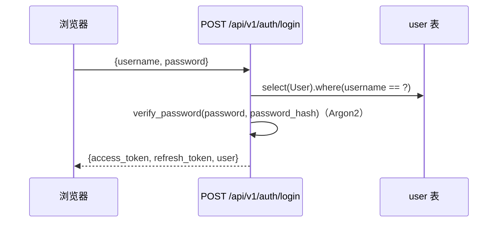
| 项 | 内容 |
| --- | --- |
| 接口 | `POST /auth/login`、`POST /auth/refresh`、`GET /auth/me` |
| 表 | `user` |
| 事务 | 请求级事务（只读） |
| 并发 | 无锁；失败分支统一 `401 INVALID_CREDENTIALS`（用户不存在、已停用、密码错误同一提示） |

| 项 | 规则 |
| --- | --- |
| 算法 | JWT HS256（`server/app/core/security.py`） |
| access_token | 默认 30 分钟（`APP_ACCESS_TOKEN_MINUTES`；compose 生产注入 480） |
| refresh_token | 默认 7 天，额外带 `version`；续期校验 `user.version == token.version`，不符则 `401 INVALID_REFRESH_TOKEN` |
| payload | `sub`（用户 id）、`token_type`、`iat`、`exp`、`jti` |
| token_type 取值 | `management_access`、`management_refresh`、`mini_program`、`mini_program_registration` |

| 时机 | 行为 |
| --- | --- |
| 请求前 | 注入 `Authorization: Bearer <access_token>` 与 `X-Request-ID`（`crypto.randomUUID()`） |
| 响应 401 且 `code=INVALID_TOKEN` | 用模块级 `refreshRequest` 单例去重刷新，成功后重放原请求 |
| 刷新失败 | 清理 `localStorage` 的 `access_token`/`refresh_token`/`auth_user`，跳登录页 |

位置：`web/src/api/client.ts`。
#### 1.2 接口令牌（`X-API-Token`）
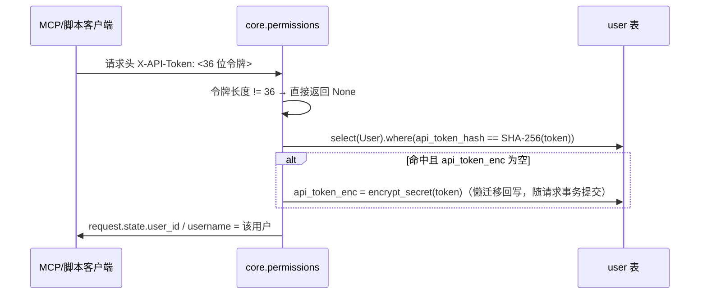
| 项 | 内容 |
| --- | --- |
| 入口 | `X-API-Token` 请求头（`APIKeyHeader`）；36 位以内的令牌也可放进 `Authorization: Bearer`，`authenticate_management_user` 会先按接口令牌尝试 |
| 表 | `user`（`api_token_hash` SHA-256 唯一索引 + `api_token_enc` Fernet 密文） |
| 令牌生成/重置 | `POST /users/{id}/api-token/regenerate`（`SuperAdmin`）；此后 `GET /users`、`PATCH /users/{id}` 每次都解密**回显**明文令牌 |
| 事务 | 懒迁移的 `api_token_enc` 回写用 `flush()`，随本次请求事务一起提交 |
| 并发 | `api_token_hash` 唯一索引保证查找唯一；回写是幂等的同值写入 |
| 失败 | 无效 `401 INVALID_TOKEN`；用户停用 `401 USER_DISABLED` |

| 项 | 说明 |
| --- | --- |
| 复用同一条认证路径 | HTTP 请求的令牌放进 `ContextVar`，MCP 工具以该用户身份调用内部业务接口 |
| 工具 | `system_whoami`、`operations_list`、`operation_describe`、`operation_call` |
| 结果 | 权限与网页端完全一致（同样经过角色校验、乐观锁、事务与审计） |
#### 1.3 微信小程序登录与建档
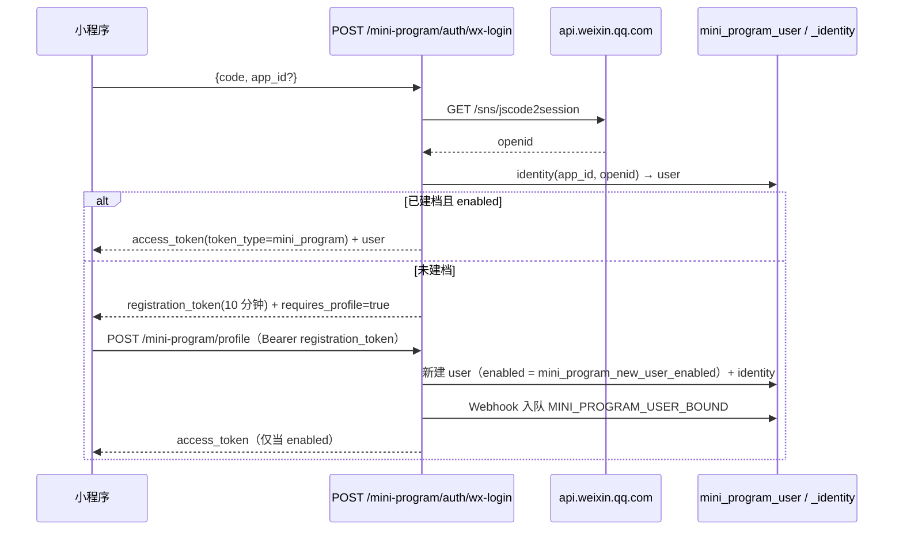
| 项 | 内容 |
| --- | --- |
| 接口 | `POST /mini-program/auth/wx-login`、`POST /mini-program/profile`、`GET /mini-program/me` |
| 表 | `mini_program_user`、`mini_program_identity`、`webhook_delivery`（建档时入队） |
| 事务 | 建档与 Webhook 入队在同一请求事务内 |
| 并发 | `uq_mini_program_identity_app_id` 唯一索引，撞号转 `409 WECHAT_USER_CREATE_CONFLICT`；`_wechat_access_tokens`、`_material_code_cache` 用模块级 `asyncio.Lock` + 单调时钟 TTL 防穿透 |
| 失败 | 待审核 `403 ACCOUNT_DISABLED`、注册关闭 `403 MINI_PROGRAM_REGISTRATION_DISABLED`、微信不可用 `503 WECHAT_AUTH_UNAVAILABLE`、凭证无效 `401 WECHAT_AUTH_FAILED` |
小程序 `miniprogram/utils/request.js` 同样做 401 静默重登去重（`refreshPromise`），并按错误码跳 `/pages/disabled/disabled` 或 `/pages/registration-closed/registration-closed`。

</TabsContent>

<TabsContent id="t1">

### 2. 入库与出库
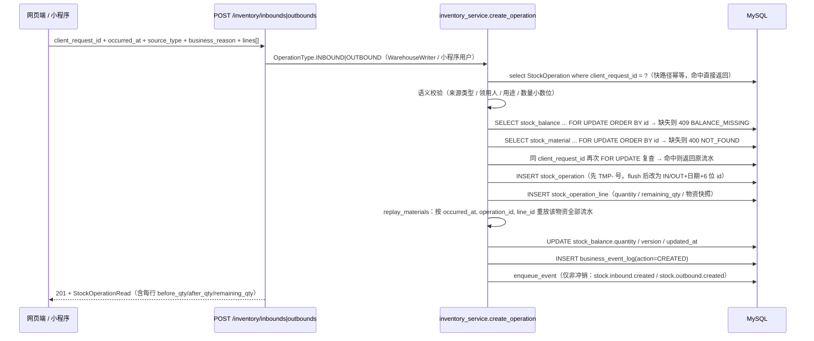
| 项 | 内容 |
| --- | --- |
| 接口 | `POST /inventory/inbounds`、`POST /inventory/outbounds`、`PATCH /inventory/operations/{id}`、`POST /inventory/operations/{id}/reverse`、`POST /mini-program/outbound` |
| 表 | `stock_operation`、`stock_operation_line`、`stock_balance`、`stock_material`、`business_event_log`、`webhook_delivery` |
| 事务 | 上述写入全部在**同一个请求事务**内，任何一步抛错整体回滚 |
| 并发 | ① 余额与物资按 `stock_material_id` **升序** `FOR UPDATE`（固定加锁顺序避免死锁）；② `client_request_id` 唯一索引 + 二次 `FOR UPDATE` 复查实现幂等；③ 修改流水时对「旧明细 + 新明细」的全部物资一起加锁后整体重放 |
| 一致性 | `stock_balance.quantity` 是「重放结果」而非增量维护：`replay_materials` 从零按 `occurred_at, operation_id, line_id` 累加（入库 `+quantity`、出库 `-quantity`），并回写每行 `before_qty`/`after_qty`，因此修改历史流水后当前余额与后续快照必然自洽 |
| 精度与边界 | 数量最多 1 位小数（`400 INVALID_QUANTITY_PRECISION`），DB 列为 `DECIMAL(18,1)`；`operation_type` 决定 `operation_no` 前缀 `IN`/`OUT`；同一 `client_request_id` 用于不同物资的小程序出库 → `409 CLIENT_REQUEST_ID_CONFLICT`；出库不校验余额是否充足，`stock_balance.quantity` 可为负 |
同一个事务内的步骤（`inventory_service.reverse_operation`）：

| 步骤 | 校验 / 结果 |
| --- | --- |
| 读取原流水 | `SELECT ... FOR UPDATE` |
| 逐行校验数量 | `quantity <= remaining_qty`，否则 `409 INSUFFICIENT_QUANTITY`；行不在原流水内 `400 INVALID_REVERSAL_LINE` |
| 新建冲销流水 | 相反 `operation_type`，带 `reversal_of_id`、`source_type=REVERSAL`、`occurred_at = max(now, 原发生时间+1µs)` |
| 回写原行 | 扣减 `remaining_qty` |
| 重算余额 | `replay_materials` |
| 审计 | `business_event_log(action=REVERSED)` |

冲销**不投递 Webhook**；对 `reversal_of_id` 非空的流水再冲销返回 `409 REVERSAL_NOT_ALLOWED`。
### 3. 低库存与补库计算
```mermaid
flowchart TD
    A[GET /inventory/balances 或 /inventory/low-stock] --> B[inventory_repository.search_inventory_materials<br/>join stock_balance + stock_replenishment_policy]
    B --> C{low_stock_only?}
    C -->|是| D[过滤 policy.enabled 且 quantity <= minimum_qty]
    C -->|否| E[返回全部]
    D --> F[inventory_repository.recent_outbound_consumption]
    E --> F
    F --> G[近 6 个自然月 OUTBOUND、source_type != REVERSAL<br/>且不存在 reversal 流水引用它 → SUM(quantity)]
    G --> H[组装 InventoryBalanceRead：current_qty / minimum_qty<br/>is_low_stock / suggested_purchase_qty]
    H --> I[POST /inventory/low-stock/{id}/create-replenishment-draft]
    I --> J{policy 存在且启用且 quantity <= minimum_qty?}
    J -->|否| K[409 NOT_LOW_STOCK]
    J -->|是| L[create_purchase_material：新建申购计划<br/>复制名称/规格/单位/备注/图片/二级库关联<br/>复用最近一次编码，usage=低库存补库<br/>remark 同时记建议数量与确认数量]
    L --> M[201 {next: purchase_material, resource_id}]
```
| 项 | 内容 |
| --- | --- |
| 接口 | `GET /inventory/balances`、`GET /inventory/low-stock`、`GET /inventory/replenishment-defaults`、`POST /inventory/low-stock/{material_id}/create-replenishment-draft`、`GET /dashboard/summary` |
| 表 | `stock_material`、`stock_balance`、`stock_replenishment_policy`、`stock_operation(_line)`、`purchase_material` |
| 事务 | 查询只读；补库草稿在一个请求事务内新建计划（含 `begin_nested()` 撞号重试） |
| 并发 | 计划号由 `material_service.next_purchase_plan_no` 生成：对 `purchase_material.plan_no` 与 `purchase_request_line.plan_no_snapshot` 分别取 `MAX` 并 `FOR UPDATE`，撞唯一索引后回滚保存点重取，最多 3 次，仍失败 `409 PLAN_NO_CONFLICT`；单日上限 999 条（`409 PLAN_DAILY_LIMIT_EXCEEDED`） |
| 不落库与空消耗 | 低库存标记与建议数量都是**实时计算**，没有预警表；近 6 个月无出库时建议数量为 0，仍允许用户手填计划数量发起补库 |
补库默认值：需求日期取上海当天，实际需求人预填最近一条有值的 `purchase_responsible`（`replenishment_service.replenishment_defaults`）；补库**只新增申购计划，不创建申购记录**。低库存工作台的低库存数量由 `dashboard_repository.count_low_stock_materials` 统计（只读决策表，精简模式下恒为 0）。

</TabsContent>

<TabsContent id="t2">

### 4. 申购计划 → 申购记录 → 到货入库
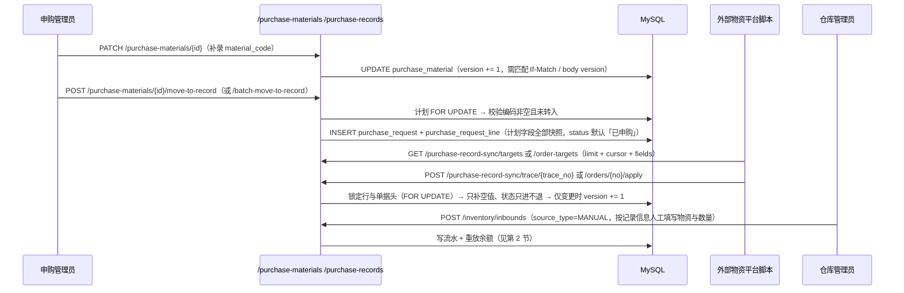
| 项 | 内容 |
| --- | --- |
| 接口 | `POST /purchase-materials/{id}/move-to-record`、`POST /purchase-materials/batch-move-to-record`、`POST /purchase-records/{line_id}/restore-to-plan`、`PATCH /purchase-records/{line_id}`、`PATCH /purchase-records/batch`、`GET /purchase-records`、`GET /purchase-records/{line_id}` |
| 表 | `purchase_material`、`purchase_request`、`purchase_request_line`、`purchase_material_image`、`purchase_request_line_image`、`file_object` |
| 事务 | 转入（计划加锁 + 新建单据）与恢复（删行/删单 + 计划回 `NORMAL`）各在**一个请求事务**内完成 |
| 并发 | 计划行、记录行、单据头都 `FOR UPDATE`；`plan_no` 唯一索引兜底；`version` 乐观锁保护详情/批量编辑 |
| 转入副作用 | 行快照字段（`plan_no_snapshot`、`material_code_snapshot`、`*_snapshot`、`purchase_qty`、`usage`、图片等）全部从计划复制；计划本身随后由**每日 02:00 清理任务**删除，清理前先把 `purchase_request_line.purchase_material_id` 置空（`with_for_update(skip_locked=True)`，每批 50 条） |
| 恢复副作用 | 原计划若已被清理，则按行快照重建一条计划（保留原 `plan_no`）；若该单只剩这一行则整单删除，否则只删除该行 |
| 到货入库 | **与申购记录无自动化关联**：没有 `received_qty` 字段、没有入库明细到申购行的外键、也没有 `prepare-inbound` 接口。仓库管理员按记录的物资与数量人工入库，「部分入库 / 已入库」状态由外部平台回写（见 [/dev-state-machines](/dev-state-machines) 第 3 节） |
计划清理任务的护栏：只清理「被记录行引用且 `plan_no_snapshot` 非空」的计划，避免旧库未回填快照时误删导致记录字段缺失。任务开关 `APP_PURCHASE_PLAN_CLEANUP_ENABLED`（默认开启），worker 名称 `purchase-plan-cleanup-worker`，每天北京时间 02:00 触发，随后循环清理直到无候选。
### 5. Excel 导入（异步任务）
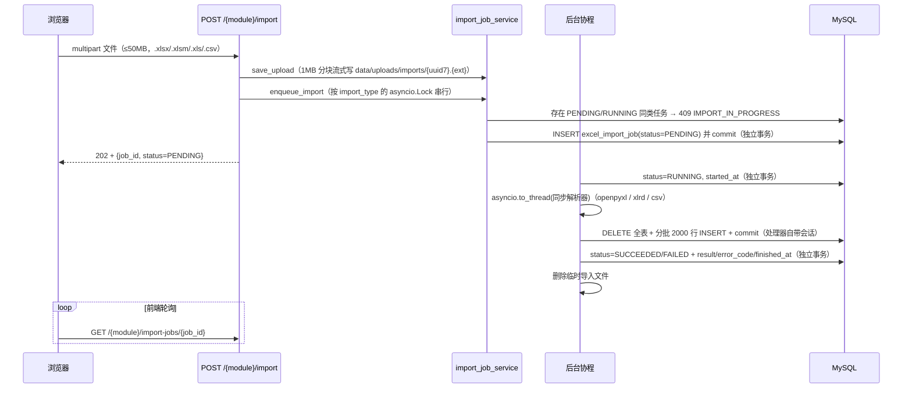
| 项 | 内容 |
| --- | --- |
| 接口 | `POST /material-code-library/import`、`POST /huaxing-inventory/import`、`POST /secondary-warehouse/import`、`GET .../import-jobs/{job_id}`、`GET .../last-import` |
| `import_type` | `MATERIAL_CODE_LIBRARY`、`HUAXING_INVENTORY`、`LITE_INVENTORY` |
| 表 | `excel_import_job` + 目标表（`material_code_library` / `huaxing_inventory` / `lite_inventory`） |
| 事务 | 三次独立 `SessionLocal` 事务（登记 / 置 `RUNNING` / 写终态）；业务写入由处理器自己的会话一次 `commit`（全量替换，失败即整表不变） |
| 并发 | ① `asyncio.Lock` 按 `import_type` 串行化「检查进行中 + 登记」，保证 409 判断原子（单进程 worker 内有效）；② 运行中的 `asyncio.Task` 存入模块级集合防 GC |
| 崩溃恢复 | 启动时 `mark_stale_jobs_failed`：遗留 `PENDING/RUNNING` 置 `FAILED` + `error_code=SERVER_RESTARTED`，并删除临时文件 |
| 保留与去重 | 临时文件在任务 `finally` 中即删；任务行由启动时 `cleanup_finished_jobs(retention_days=30)` 清理（**无周期性 worker**）；精简模式导入对「名称+规格+单位+数量+备注」完全相同的行只保留一条，返回 `imported_count` / `deduplicated_count` |
### 6. Excel 导出（异步任务）
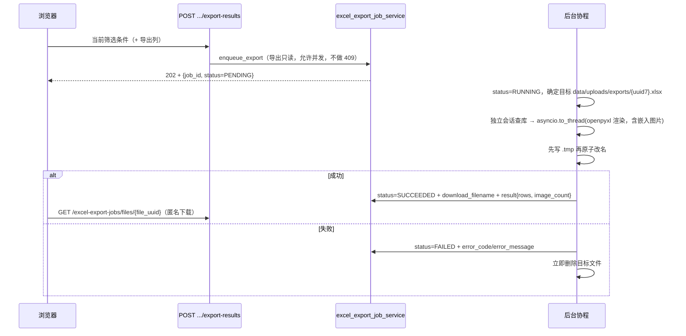
| 项 | 内容 |
| --- | --- |
| 接口 | `POST /purchase-records/export-results`、`POST /purchase-materials/export-results`、`GET /excel-export-jobs/{job_id}`、`GET /excel-export-jobs/files/{file_uuid}` |
| 表 | `excel_export_job`（`params` 保存请求快照，供后台任务重放筛选条件） |
| 事务 | 登记与写终态各一个独立事务；渲染查库用处理器自己的会话 |
| 并发 | 导出只读，允许并发；`_running_tasks` 防 GC；单次导出行数上限 10000（超出 `400 EXPORT_RESULT_LIMIT_EXCEEDED`） |
| 可见性 | 状态查询仅创建者本人或超管（否则 `400 NOT_FOUND`）；**文件下载不鉴权**，安全性依赖 uuid7 不可猜解 + 文件仅存在于 `exports/` 目录 |
| 清理 | `run_cleanup_worker` 每 24 小时删除 3 天前的终态任务行及其文件，并顺带删除超过 24 小时的 `.tmp` 孤儿文件；启动时 `mark_stale_exports_failed` 处理重启残留 |

| 项 | 内容 |
| --- | --- |
| 接口 | `GET /purchase-materials/export-uncoded`（物料编码申请表）、`POST /purchase-materials/export-purchase-application`、`POST /purchase-materials/export-purchase-approval` |
| 特点 | 不走任务队列，由 `excel_export_service.render_excel` 读 `server/app/templates/*.json` 在内存生成工作簿后直接返回 |
| 错误 | 模板缺失 `EXPORT_TEMPLATE_MISSING`、模板非法 `EXPORT_TEMPLATE_INVALID` |
### 7. 图片上传与读取（含悬空文件清理）
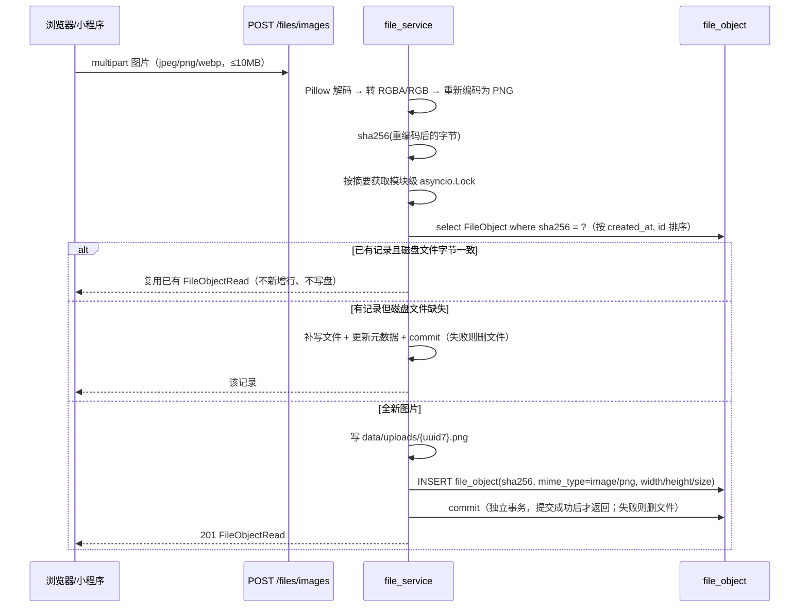
| 项 | 内容 |
| --- | --- |
| 表 | `file_object` + 关联表 `stock_material_image`、`purchase_material_image`、`purchase_request_line_image`（`(owner_id, file_id, sort_order)`） |
| 磁盘 | `APP_UPLOAD_DIR`（默认 `server/data/uploads`），文件名 `{file_id}.png`；`lifespan` 启动时确保目录存在 |
| 事务 | 上传与删除是**独立事务**（显式 `commit`），与业务单据保存分开：先上传拿到 `file_id`，再在表单提交时把 `image_ids` 带进 POST/PATCH |
| 并发 | 同一摘要的并发上传用模块级 `asyncio.Lock`（`_digest_lock`，引用计数归零后回收）串行化，避免重复写盘 |
| 约束 | 类型白名单 `image/jpeg|png|webp`（其它 `400 INVALID_IMAGE_TYPE`）；大小上限 10MB（`413 IMAGE_TOO_LARGE`）；`image_ids` 含不存在的 id 报 `INVALID_IMAGE_ID` |
| 读取 | `GET /files/images/{id}` **不鉴权**（`` 无法携带鉴权头），`Cache-Control: public, max-age=86400, s-maxage=2592000`；带 `size=16..2048` 时用 Pillow 生成等比 WebP 预览（quality 82） |
| 删除与悬空清理 | `DELETE /files/images/{id}`：被任一业务关联表引用则 `409 FILE_IN_USE`，否则删行并删磁盘文件。`GET /files/images/orphans?older_than_hours=24`（超管）报告三类：超过保护期且未被引用的记录、无记录但命名匹配 `{uuid7}.png` 的磁盘文件、有记录但磁盘缺失的文件；`DELETE /files/images/orphans` 删除前两类（**不删除「磁盘缺失」记录**） |
图片地址由 `file_id` 推导，不持久化域名或路径：前端 `web/src/utils/image.ts` 用 `VITE_IMAGE_BASE_URL`（可被「图片加速服务器地址」配置覆盖）拼接，`imagePreviewUrl` 追加 `?size=`。

</TabsContent>

<TabsContent id="t3">

### 8. 链接分享公开页
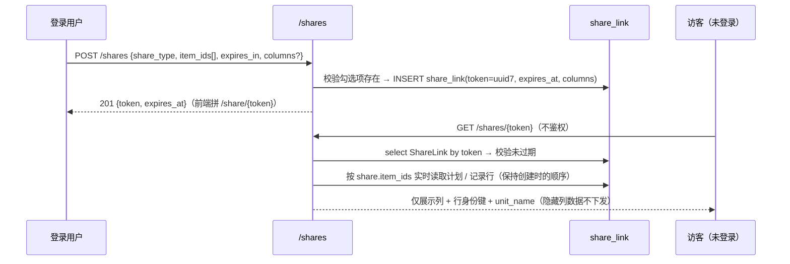
| 项 | 内容 |
| --- | --- |
| 表 | `share_link`（`token` UUIDv7 主键、`share_type`、`item_ids` JSON、`columns` JSON/NULL、`expires_at`、`created_by`） |
| 事务与并发 | 创建/更新/撤回都是请求级事务，定期清理是独立事务；无行锁，撤回即物理删除，删除后匿名读取立即失败 |
| 校验 | `SHARE_NOT_FOUND` / `SHARE_EXPIRED`（均 400）；改/删仅创建者或超管（否则 403）；列名非法 `422 VALIDATION_ERROR` |
| 展示列 | `columns = NULL` → 默认列（该类型全部列去掉「状态」）；`unit_name` 始终下发用于渲染数量单位；`id`（计划）/`line_id`（记录）作为行身份键始终下发 |
| 前端 | 公开路由 `/share/:token` → `web/src/views/public/ShareView.vue`（`meta.public = true`，路由守卫不要求登录） |
| 清理 | 启动时 + 每日 worker（`share-link-cleanup-worker`）删除 `expires_at < now` 的行 |
### 9. 采购记录同步（外部平台回写）
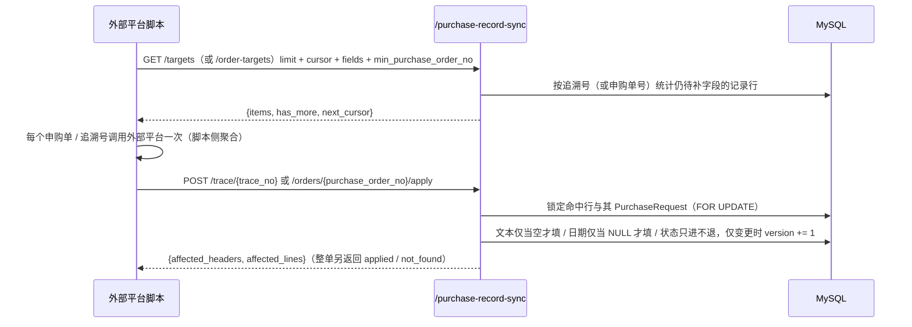
| 项 | 内容 |
| --- | --- |
| 表 | `purchase_request`（合同号/船号/集港日期与港口/发船日期/申购日期/备注）、`purchase_request_line`（业务员/合同签订日期/状态/追溯号） |
| 事务 | 一次请求一个事务，`flush()` 后由 `get_db` 统一提交 |
| 并发 | 命中行与单据头 `FOR UPDATE`；`version` 逐条自增供前端乐观锁；整单回写中某追溯号不存在只计入 `not_found` 并继续处理其余项 |
| 同步字段白名单 | `salesperson`、`contract_no`、`vessel_no`、`consolidation_port`、`consolidation_date`、`sailing_date`、`contract_sign_date`、`status`；未知字段 `422 VALIDATION_ERROR` |
| 分页 | 游标分页（`cursor` → `next_cursor`，非 `page/page_size` 模型），`limit` 1..200 |
| 权限 | 全部端点要求 `PurchaseWriter`（读接口也要求） |
### 10. Webhook 投递
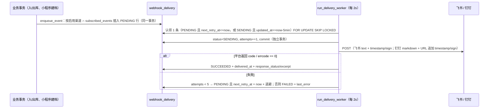
| 项 | 内容 |
| --- | --- |
| 表 | `webhook_channel`（渠道配置，地址与密钥 Fernet 加密）、`webhook_delivery`（投递队列，`uq(event_id, channel_id)` 去重） |
| 事件 | `stock.outbound.created`、`stock.inbound.created`、`mini_program.user.bound`（另有测试事件 `webhook.test`，不入库） |
| 事务 | 入队复用业务请求事务；认领与结算是两个独立 `SessionLocal` 事务 |
| 并发 | `with_for_update(skip_locked=True)` 下单 worker 安全；`SENDING` 5 分钟租约处理进程崩溃；HTTP 客户端 `httpx.AsyncClient(timeout=8s, connect=3s)` |
| 退避 | `1/5/15/60/180` 分钟，最多 5 次尝试（第 5 次失败置 `FAILED`） |
| 配置校验 | 地址必须 https 且域名/路径匹配平台（飞书 `open.feishu.cn`/`open.larksuite.com` + `/open-apis/bot/v2/hook/`；钉钉 `oapi.dingtalk.com` + `/robot/send`），否则 `422 INVALID_WEBHOOK_URL` |
| 关闭 | `lifespan` 退出时置 stop_event、等待 worker 结束并 `close_client()` |
### 11. AI 搜索
```mermaid
flowchart TD
    A[查询接口带 ai_expand=true] --> B[expand_search_value non-strict]
    B --> C{配置存在且 enabled 且有 API Key?}
    C -->|否| D[原样返回关键词，不报错]
    C -->|是| E{缓存命中（key = 配置 version + 关键词，<br/>TTL 30 分钟，上限 1000 条）?}
    E -->|是| F[返回缓存的同义词/近义词组]
    E -->|否| G[POST {endpoint}/chat/completions（OpenAI 兼容）<br/>10s 响应超时 / 3s 连接超时]
    G --> H{上游返回}
    H -->|成功| I[解析 JSON → 每组最多 6 个扩展词 → 用 | 连接]
    H -->|失败| J[non-strict：记 warning 并回退原关键词<br/>strict（/ai-search/expand）：抛 AI_* 错误]
    I --> K[写缓存]
    K --> L[作为 OR 关键词交给 repository 的 contains_any]
```
| 项 | 内容 |
| --- | --- |
| 接口 | `GET /ai-search/status`（任意登录用户）、`POST /ai-search/expand`（strict）、`GET/PUT /ai-search/settings`（`SuperAdmin`）、`POST /ai-search/settings/test`（30s 超时、不走缓存） |
| 表 | `system_setting`（`setting_key = ai_search_config`，JSON 含 endpoint/model/enabled/加密 API Key 与小程序、二级库各开关）、`business_event_log`（`action=AI_SEARCH_CONFIG_UPDATED`，记录前后配置） |
| 事务与并发 | 配置写入走请求事务 + `version` 乐观锁（不符 `409 VERSION_CONFLICT`），AI 调用本身无事务；进程内字典缓存 `_cache` + `httpx.AsyncClient` 单例，多实例部署时缓存不共享 |
| 密钥 | `_encrypt_api_key` / `_decrypt_api_key` 用 Fernet 加密入库、读取回显；解密失败 `503 AI_API_KEY_DECRYPT_FAILED` |
| 降级 | 业务查询的 `ai_expand` 失败**不影响结果**（回退原关键词）；仅显式 `/ai-search/expand` 返回 `503 AI_NOT_CONFIGURED` 或上游错误码（`AI_RESPONSE_TIMEOUT` 等） |
| 搜索语义 | 关键词可用 `|` 或 `｜` 分隔多词，同一参数内 OR、不同参数间 AND（`common.split_or_search_terms`、`common.contains_any`） |

</TabsContent>

<TabsContent id="t4">

### 12. 其它链路索引
| 链路 | 关键接口 | 主要表 |
| --- | --- | --- |
| 二级库物资建档与安全库存 | `POST/PATCH /stock-materials`、`PUT /stock-materials/{id}/replenishment-policy` | `stock_material`、`stock_material_image`、`stock_balance`、`stock_replenishment_policy` |
| 周期性计划一键生成 | `POST /purchase-plan-templates/{id}/generate` | `purchase_plan_template`（读） → `purchase_material`（写，计划日期取生成当天） |
| 小程序扫码与出库 | `GET /mini-program/materials/{uuid}`、`GET /mini-program/inventory`、`POST /mini-program/outbound` | `stock_material`、`stock_balance`、`stock_operation(_line)` |
| 小程序码生成 | `GET /stock-materials/{id}/mini-program-code`（307 重定向 → 带 uuid 的接口） | 无（微信接口 + 内存缓存） |
| 物料编码存在性校验 | `GET /material-code-library/exists` | `material_code_library` |
| 备忘录 | `GET/POST/PATCH/DELETE /memos` | `memo`（草稿与字号存浏览器本地） |
| 版本信息 | `GET /version` | 无（读构建期注入的 `APP_BUILD_TIME` / `APP_GIT_SHA`） |
字段级细节见 [/dev-data-model](/dev-data-model)，状态迁移与错误码见 [/dev-state-machines](/dev-state-machines)，后端分层与配置见 [/dev-backend](/dev-backend)。

</TabsContent>

</Tabs>
