# 状态机

本页汇总代码中**真实存在**的枚举与状态流转：取值来自 `server/app/domain/enums.py`，流转规则来自
`server/app/services/` 各服务与 `server/app/api/v1/` 路由，错误码来自 `server/app/core/errors.py`
与各服务内的 `AppError(...)`。

两个前提必须先说明：

1. **系统没有通用审批流引擎**。`server/app/core/errors.py` 提供了 `invalid_transition(current, action)`
   （错误码 `INVALID_STATUS_TRANSITION`、HTTP 409、`details={current_status, action}`），但 `grep`
   全仓库只有它的定义、**没有任何调用点**：当前所有状态字段要么由「只进不退」的同步规则约束，
   要么可被有写权限的用户自由赋值。逐条见下文。
2. 下文的 Mermaid 图需要站点安装 Mermaid 渲染插件才会出图（`docs/websites/package.json` 当前只有
   `vitepress`），未渲染时按代码块显示源码，不影响构建。

按主题分组，点上方标签切换。

<Tabs :tabs="[
  { id: 't0', title: '枚举与申购状态' },
  { id: 't1', title: '库存流水与冲销' },
  { id: 't2', title: '异步任务与推送' },
  { id: 't3', title: '小程序与分享' },
  { id: 't4', title: '错误码总表' }
]">

<TabsContent id="t0">

### 1. 枚举总表

| 枚举 | 取值（代码/API 层） | 数据库存储 | 说明 |
| --- | --- | --- | --- |
| `Role` | `SUPER_ADMIN` / `WAREHOUSE_ADMIN` / `PURCHASE_ADMIN` / `READ_ONLY` | ENUM 同名 | 一个用户一个角色 |
| `OperationType` | `INBOUND` / `OUTBOUND` | ENUM 同名 | 流水类型 |
| `SourceType` | `MANUAL` / `MINI_PROGRAM` / `REVERSAL` / `INITIALIZATION` | ENUM 同名 | 来源类型；**无** `PURCHASE_RECEIPT` |
| `PurchasePlanStatus` | `正常` / `暂不申购` / `已归档` | ENUM `NORMAL` / `DEFERRED` / `ARCHIVED` | DB 存枚举名，API 返回中文值 |
| `MiniProgramCodeEnv` | `trial` / `release` | — | 小程序码环境 |
| `MiniProgramStockStatus` | `normal` / `out_of_stock` / `low_stock` | 计算得出，不落库 | 小程序库存标签 |
| `MiniProgramFeatureMode` | `disabled` / `query_only` / `read_write` | 存在 `system_setting.setting_value` JSON | 5 个小程序功能页各自一档 |
| `SecondaryWarehouseMode` | `full` / `lite` | 同上 | 二级库运行模式 |
| `WebhookPlatform` | `FEISHU` / `DINGTALK` | ENUM 同名 | 推送渠道 |
| `WebhookEventType` | `stock.outbound.created` / `stock.inbound.created` / `mini_program.user.bound` | `webhook_delivery.event_type` 存枚举**名**（`STOCK_OUTBOUND_CREATED` 等） | `webhook_channel.subscribed_events` JSON 存**值**（点号形式） |
| `WebhookDeliveryStatus` | `PENDING` / `SENDING` / `SUCCEEDED` / `FAILED` | ENUM 同名 | 投递队列 |
| `ExcelImportJobStatus` / `ExcelExportJobStatus` | `PENDING` / `RUNNING` / `SUCCEEDED` / `FAILED` | ENUM 同名 | 异步任务 |
| `ShareType` | `purchase_plan` / `purchase_record` | ENUM 同名 | 分享数据类型 |
| `ShareExpiryOption` | `24h` / `3d` / `7d` / `30d` / `permanent` | 换算为 `share_link.expires_at`（`permanent` → `NULL`） | 前端选择码，不落库 |
| 申购记录状态 | 自由字符串（`VARCHAR(128)`，默认 `已申购`） | 原样存字符串 | 取值非枚举，筛选项由库中 `DISTINCT` 得出 |
| `urgency` / `category` | 自由字符串 | 原样字符串 | 前端候选：`正常/紧急/非常紧急`、`工具/消耗物资/备品备件` |

### 2. 申购计划状态机（`PurchasePlanStatus`）

#### 2.1 流转

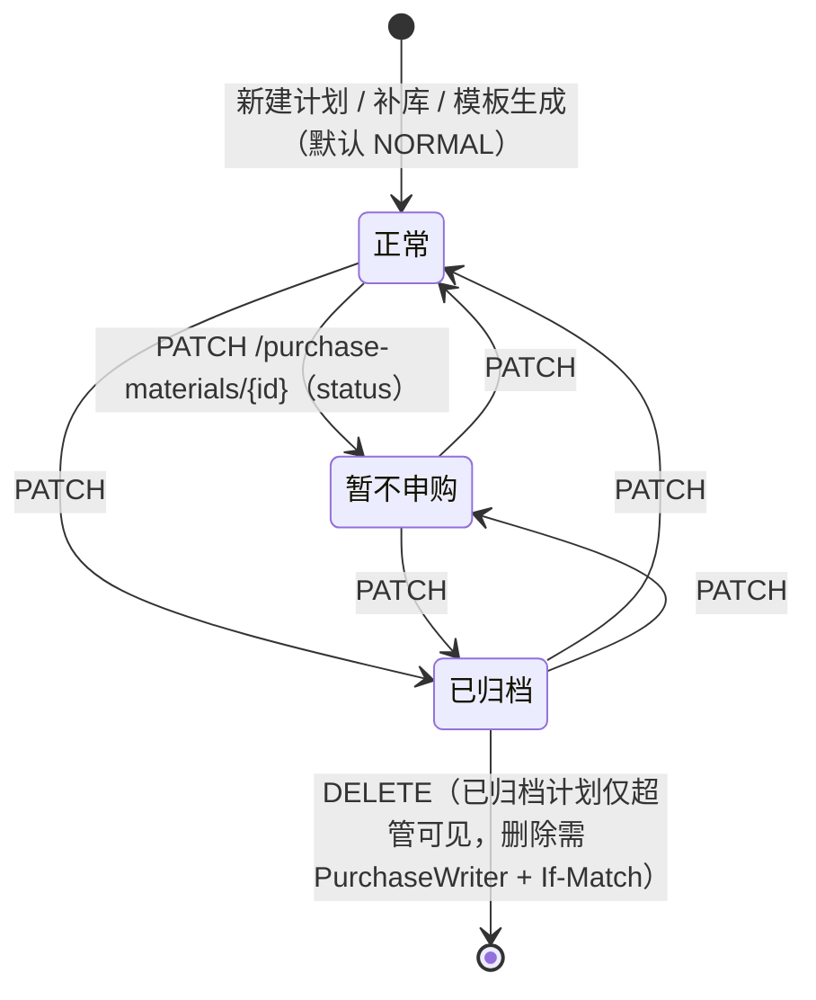

| 当前状态 | 动作 | 目标状态 | 校验/错误码 |
| --- | --- | --- | --- |
| 任意 | `PATCH /purchase-materials/{id}`（body 含 `status`） | body 指定值 | 版本不符 `409 VERSION_CONFLICT`；**无流转合法性校验**，三值可任意互转 |
| 任意 | `PATCH /purchase-materials/batch` | body 指定值 | 逐条 `version` 校验；同上无流转校验 |
| 任意 | 新建 / 补库 `create-replenishment-draft` / 模板 `generate` | `正常` | 硬编码写入 `PurchasePlanStatus.NORMAL` |
| 已归档 | `GET /purchase-materials`（`status=已归档`）或详情 | — | 非超管 `403 ARCHIVED_PURCHASE_PLAN_FORBIDDEN` |
| 已转入申购记录 | `DELETE /purchase-materials/{id}` | 删除失败 | `409 PURCHASE_PLAN_IN_USE` |
| 未编码（`material_code IS NULL`） | `POST .../move-to-record` | 拒绝 | `409 MATERIAL_CODE_REQUIRED`，`details.material_ids` |

非超管角色的列表查询会被强制限定为 `status=[正常]`（`server/app/api/v1/purchase_materials.py` 的
`list_materials`、`filter_options`、`export_material_results` 三处），因此「暂不申购」与「已归档」
对普通角色不可见——这是**查询层过滤**，不是状态机限制。

#### 2.2 「是否已转入申购记录」不是字段

`moved` 不是列，由 `purchase_request_line.purchase_material_id` 是否存在判定
（`material_service.purchase_material_ids_moved_to_record`、`purchase_materials_for_export(moved=)`）。

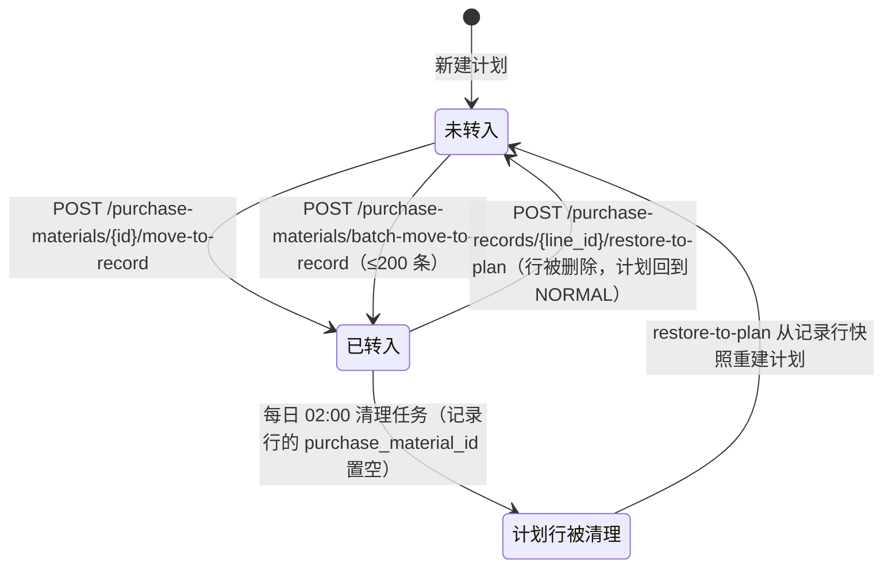

| 当前状态 | 动作 | 目标状态 | 校验/错误码 |
| --- | --- | --- | --- |
| 未转入且已编码 | `move-to-record` / `batch-move-to-record` | 已转入（生成 `purchase_request` + 行） | 计划不存在 `400 NOT_FOUND` |
| 已转入 | 再次 `move-to-record` | 拒绝 | `409 PLAN_ALREADY_MOVED`，`details.material_ids` |
| 未编码 | `move-to-record` | 拒绝 | `409 MATERIAL_CODE_REQUIRED` |
| 已转入 | `restore-to-plan` | 未转入 | 版本不符 `409 VERSION_CONFLICT`；仅剩一行时整单删除，否则删除该行 |
| 已转入（原计划已被清理） | `restore-to-plan` | 未转入（计划由快照重建，保留原 `plan_no`） | `purchase_request_service.restore_purchase_record_to_plan` |

转入时的默认值：请求体 `status` 默认 `已申购`（`MovePurchasePlanRequest`）；`purchase_order_no`
未显式传时按上海日期生成「申购 y/m/d」（`default_purchase_order_no`）。

### 3. 申购记录行状态（`purchase_request_line.status`）

#### 3.1 取值与「只进不退」

状态不是枚举，而是 `VARCHAR(128)`，默认 `已申购`；筛选项由 `purchase_status_options` 对库中
`status` 去重得到。同步回写时按下面的白名单**只进不退**（`purchase_record_sync_service._STATUS_PROGRESSION`）：

| 目标状态 | 允许的当前状态 | 结果 |
| --- | --- | --- |
| `已采购` | `已申购`、`已采购` | 允许（`已采购 → 已采购` 视为无变化） |
| `部分入库` | `已申购`、`已采购`、`部分入库` | 允许 |
| `已入库` | `已申购`、`已采购`、`部分入库`、`已入库` | 允许，**允许跳跃**（如 `已申购 → 已入库`） |

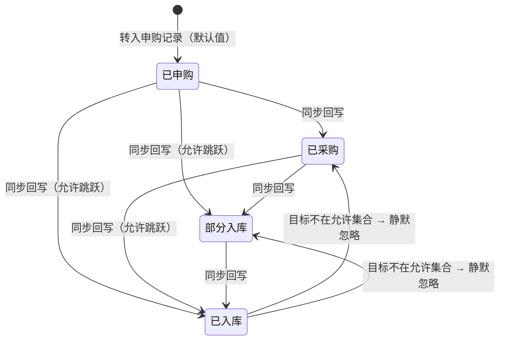

关键差异（与「状态机报错」的直觉不同）：

- **非法回退不报错**：目标状态不在允许集合时，`_apply_mutation` 直接 `continue` 跳过该字段，
  接口返回 `200` 并只在 `affected_lines` 里体现「未变更」。没有 `INVALID_STATUS_TRANSITION`。
- **没有到货数量驱动的自动状态**：`received_qty`、`purchase_request_line_id`、`PURCHASE_RECEIPT`
  在代码与 `init.sql` 中都不存在（`server/tests/integration/test_procurement.py` 明确断言响应中
  **没有** `received_qty`）。「部分入库 / 已入库」由外部平台回写，不由本系统的入库流水计算。
- 人工批量修改（`PATCH /purchase-records/batch`）可以写任意状态字符串，同样不做流转校验，
  只校验每个 `version`（不一致 `409 VERSION_CONFLICT`）。

#### 3.2 回写动作（外部平台 → 本系统）

| 当前状态 | 动作 | 目标状态 | 说明 |
| --- | --- | --- | --- |
| 任意 | `GET /purchase-record-sync/targets` | 不变 | 按追溯号返回待同步目标（字段白名单过滤 + 游标分页） |
| 任意 | `POST /purchase-record-sync/trace/{trace_no}` | 按上文白名单 | 追溯号不存在 `400 NOT_FOUND`；空追溯号 `422 VALIDATION_ERROR` |
| 任意 | `GET /purchase-record-sync/order-targets` | 不变 | 按申购单号分组的整单目标 |
| 任意 | `POST /purchase-record-sync/orders/{purchase_order_no}/apply` | 按上文白名单 | 某追溯号在该单下不存在时计入 `not_found` 并**继续**处理其余项 |

字段级规则：文本字段（`salesperson`、`contract_no`、`vessel_no`、`consolidation_port`）
**仅在当前为空时**才写入，日期字段（`consolidation_date`、`sailing_date`、`contract_sign_date`）
**仅在当前为 `NULL`** 时写入；只有实际变更才 `version += 1`。未知同步字段报 `422 VALIDATION_ERROR`。

</TabsContent>

<TabsContent id="t1">

### 4. 库存流水类型与冲销

#### 4.1 类型与来源组合

| `operation_type` | `source_type` | 是否允许 | 错误码 |
| --- | --- | --- | --- |
| `INBOUND` | `MANUAL` | ✅ | — |
| `INBOUND` | `INITIALIZATION` | ✅（初始化建账） | — |
| `INBOUND` | `REVERSAL` | ❌ 仅由冲销接口内部创建 | `400 INVALID_SOURCE_TYPE`（`source_type=REVERSAL` 但无 `reversal_of_id`） |
| `INBOUND` | `MINI_PROGRAM` | ❌ | `400 INVALID_SOURCE_TYPE`（小程序来源只能是出库） |
| `OUTBOUND` | `MANUAL` | ✅ 必须填 `business_reason` 与 `receiver_name` | `400 BUSINESS_REASON_REQUIRED` / `400 RECEIVER_REQUIRED` |
| `OUTBOUND` | `MINI_PROGRAM` | ✅ 只能由 `/mini-program/outbound` 创建 | `400 INVALID_SOURCE_TYPE`（普通接口伪造小程序来源） |
| `OUTBOUND` | `REVERSAL` | ✅（冲销出库时无领用人要求） | — |
| 任意入库 | 带 `receiver_name` / `receiver_unit` | ❌ | `400 INVALID_RECEIVER` / `400 INVALID_RECEIVER_UNIT` |

补充：入库时 `source_type=MINI_PROGRAM` 会被**落库改写为 `MANUAL`**，读路径再由
`common.operation_source_type` 根据 `mini_program_user_name_snapshot IS NOT NULL` 判定为
`MINI_PROGRAM`；小程序流水必须始终保持该来源（改流水时若清空来源报 `400 INVALID_SOURCE_TYPE`）。

#### 4.2 幂等（`client_request_id`）

| 当前状态 | 动作 | 目标状态 | 错误码 |
| --- | --- | --- | --- |
| 已存在同 `client_request_id` 的流水 | 再次提交入/出库 | 直接返回**原流水**，不重复改库存 | 无（幂等成功） |
| 同上，且小程序出库的物资与请求不一致 | 再次提交 | 拒绝 | `409 CLIENT_REQUEST_ID_CONFLICT` |

#### 4.3 冲销生命周期

冲销不修改原流水行的数量，而是在原流水明细行上扣减 `remaining_qty`（剩余可冲数量），并新建一条
方向相反的流水（`reversal_of_id` 指向原流水）。

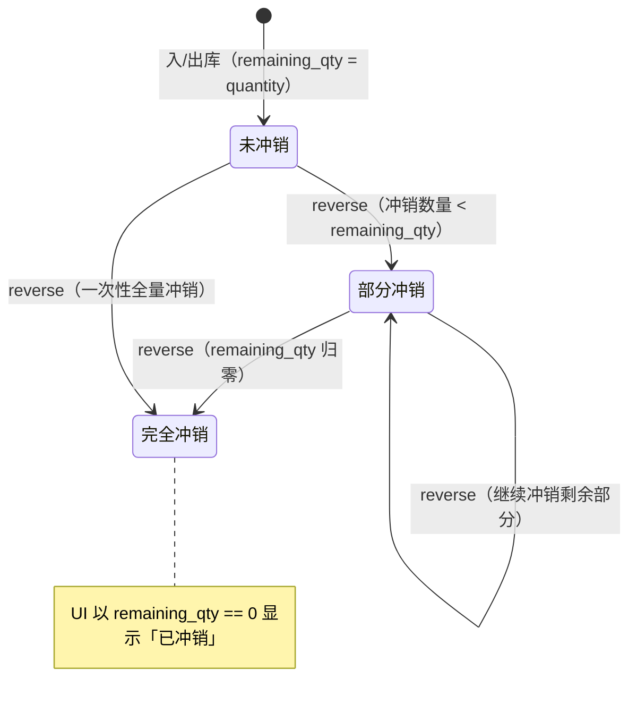

| 当前状态 | 动作 | 目标状态 | 错误码 |
| --- | --- | --- | --- |
| 非冲销流水 | `POST /inventory/operations/{id}/reverse` | 生成反向流水 | 原流水不存在 `400 NOT_FOUND` |
| 冲销行不在原流水内 | 同上 | 拒绝 | `400 INVALID_REVERSAL_LINE` |
| 冲销数量 > `remaining_qty` | 同上 | 拒绝 | `409 INSUFFICIENT_QUANTITY`（消息含剩余可冲数量） |
| 冲销流水本身 | 再次冲销 | 前端禁用按钮（`is_reversed == true`） | **后端未校验**：`reverse_operation` 不检查原流水 `source_type`，直接调用仍会生成反向流水 |
| 任意 | 幂等重复提交 | 返回原冲销流水 | 无 |

冲销流水的 `occurred_at = max(now, 原流水 occurred_at + 1µs)`，继承原流水 `subitem_no`，
`receiver_name`/`receiver_unit` 强制为空；冲销**不触发** Webhook 事件（只有
`reversal_of_id IS NULL` 的新流水才 `enqueue_event`）。

`StockOperationRead.is_reversed` 的真实语义是「这条记录本身是冲销记录」
（`reversal_of_id is not None`），不是「已被冲销」；是否还能冲销要看明细行的 `remaining_qty`。

#### 4.4 已确认流水修改（重放而非状态流转）

`PATCH /inventory/operations/{id}` 允许改类型、时间、原因、领用人、子项号、物资明细与数量，
随后按 `occurred_at, operation_id, line_id` 顺序**重放受影响物资的全部流水**，重算每条流水的
`before_qty`/`after_qty` 与 `stock_balance.quantity`（`inventory_service.replay_materials`）。
可修改后的状态后果：允许结果为负库存，也不再有「到货数量」可回写（见第 3 节）。
流水号、`client_request_id`、创建人为系统字段，不在可改列表内（`OperationUpdate` 无这些字段，
请求体多余字段因 `extra='forbid'` 报 `422`）。

### 5. 库存余额与库存标签状态

#### 5.1 余额

| 当前状态 | 动作 | 结果 | 错误码 |
| --- | --- | --- | --- |
| 余额行缺失 | 任意入/出库、修改流水 | 拒绝 | `409 BALANCE_MISSING`（物资创建时同事务建余额行） |
| 余额为负 | 出库、重放 | 允许 | 无 |
| 余额任意 | 任何直接改余额的请求 | **接口不存在** | 无此接口（只能在 `replay_materials` 内被改写） |

#### 5.2 小程序库存状态（`MiniProgramStockStatus`，查询时计算）

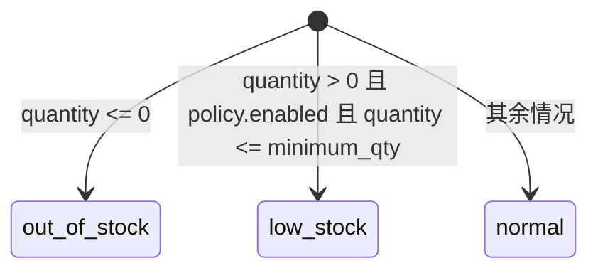

| 状态 | 判定（`mini_program_service._stock_status`） | 列表筛选条件 |
| --- | --- | --- |
| `out_of_stock` | `quantity <= 0` | `coalesce(quantity,0) <= 0` |
| `low_stock` | `quantity > 0` 且策略启用且 `quantity <= minimum_qty` | 同上再加 `policy.enabled` |
| `normal` | 其他（含无策略、策略停用、余额充足） | 不筛选时的默认结果 |

</TabsContent>

<TabsContent id="t2">

### 6. Excel 导入任务状态机

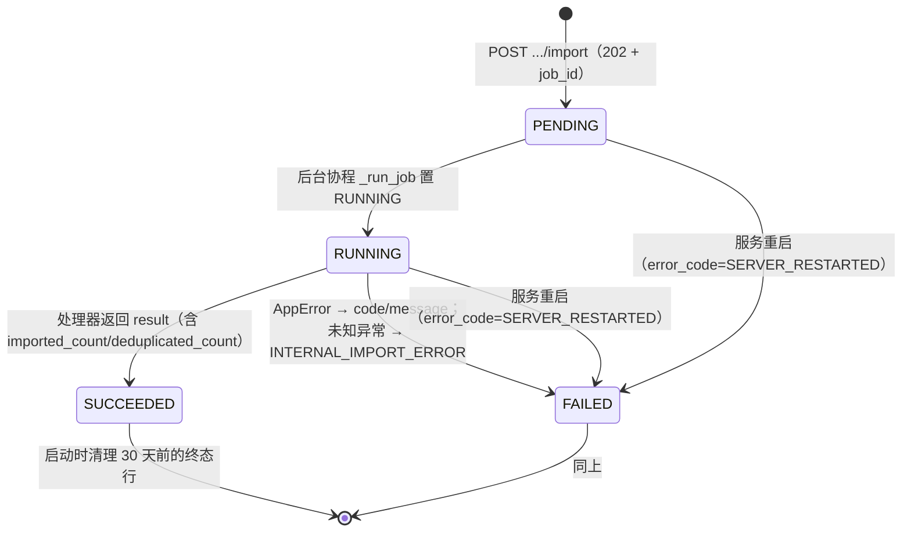

| 当前状态 | 动作 | 目标状态 | 错误码/说明 |
| --- | --- | --- | --- |
| 无任务 | 上传并登记（`/secondary-warehouse/import`、`/material-code-library/import`、`/huaxing-inventory/import`） | `PENDING` → 立即返回 `202` | 文件 >50MB `EXCEL_FILE_TOO_LARGE`；后缀非 `.xlsx/.xlsm/.xls/.csv` `400 UNSUPPORTED_EXCEL_FILE` |
| 同 `import_type` 存在 `PENDING`/`RUNNING` | 再次上传 | 拒绝 | `409 IMPORT_IN_PROGRESS`（进程内 `asyncio.Lock` 按类型串行化，单 worker 有效） |
| `PENDING`/`RUNNING` | 进程重启 | `FAILED` | `error_code=SERVER_RESTARTED`，并删除临时文件（`mark_stale_jobs_failed`） |
| `SUCCEEDED`/`FAILED` | 查询 `GET .../import-jobs/{job_id}` | 不变 | 不存在 `400 NOT_FOUND` |
| `RUNNING` | 处理器抛 `AppError` | `FAILED` | 记 `error_code`/`error_message`（截断 1000 字符） |

三种 `import_type` 与各自的表头/校验：`LITE_INVENTORY`（`物资名称/型号规格/单位/数量/备注`）、
`MATERIAL_CODE_LIBRARY`（`编码/名称/型号/记账单位名称`）、`HUAXING_INVENTORY`。三者都是
**全量替换**（`DELETE` 全表 + 分批 2000 行 `INSERT`，单次 `commit`），因此没有「逐行状态」。
解析失败的错误码以类型前缀区分，如 `LITE_IMPORT_HEADERS_MISSING`、`HUAXING_IMPORT_CODE_REQUIRED`、
`MATERIAL_CODE_IMPORT_DUPLICATE` 等。

### 7. Excel 导出任务状态机

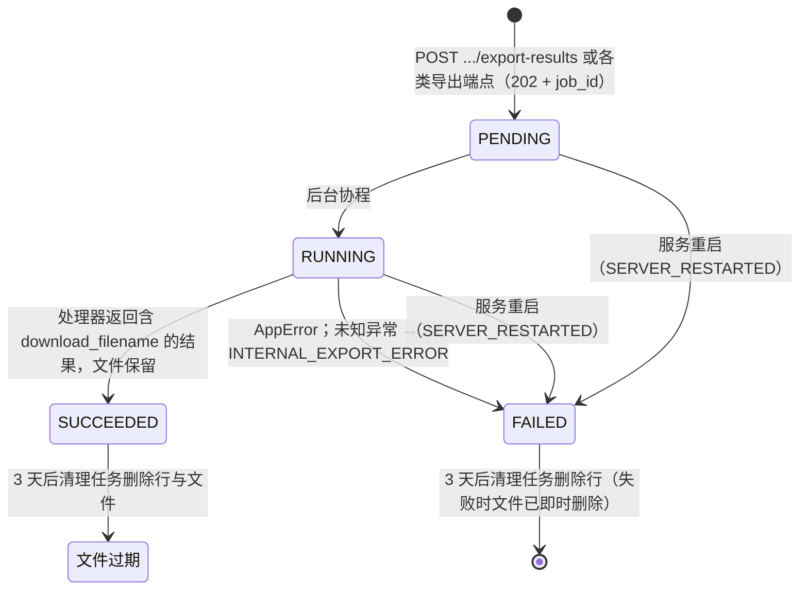

| 当前状态 | 动作 | 目标状态 | 错误码/说明 |
| --- | --- | --- | --- |
| 无任务 | 创建导出 | `PENDING`，`202` | 导出只读，**允许并发**（不像导入做 409 限制） |
| 查询行数 > 10000 | `POST /purchase-records/export-results` | 任务转 `FAILED` | `400 EXPORT_RESULT_LIMIT_EXCEEDED`，`details={total, limit}` |
| `SUCCEEDED` | `GET /excel-export-jobs/{job_id}` | 不变 | 非创建者且非超管 `400 NOT_FOUND` |
| `SUCCEEDED` | `GET /excel-export-jobs/files/{file_uuid}` | 不变 | 匿名下载；文件缺失/过期 `400 EXPORT_FILE_EXPIRED` |
| 任意 | 在 `exports/` 目录留下 `.tmp` 孤儿文件 | 24 小时后被清理任务删除 | 原子写盘中途崩溃所致 |

导出类型：`PURCHASE_PLAN_RESULTS`、`PURCHASE_RECORD_RESULTS`（异步 + 进度）；另有同步导出
（`/purchase-materials/export-uncoded`、`/export-purchase-application`、`/export-purchase-approval`），
其校验失败码为 `409 PURCHASE_APPLICATION_EXPORT_FIELDS_REQUIRED` /
`409 PURCHASE_APPROVAL_EXPORT_FIELDS_REQUIRED`。

### 8. Webhook 投递状态机

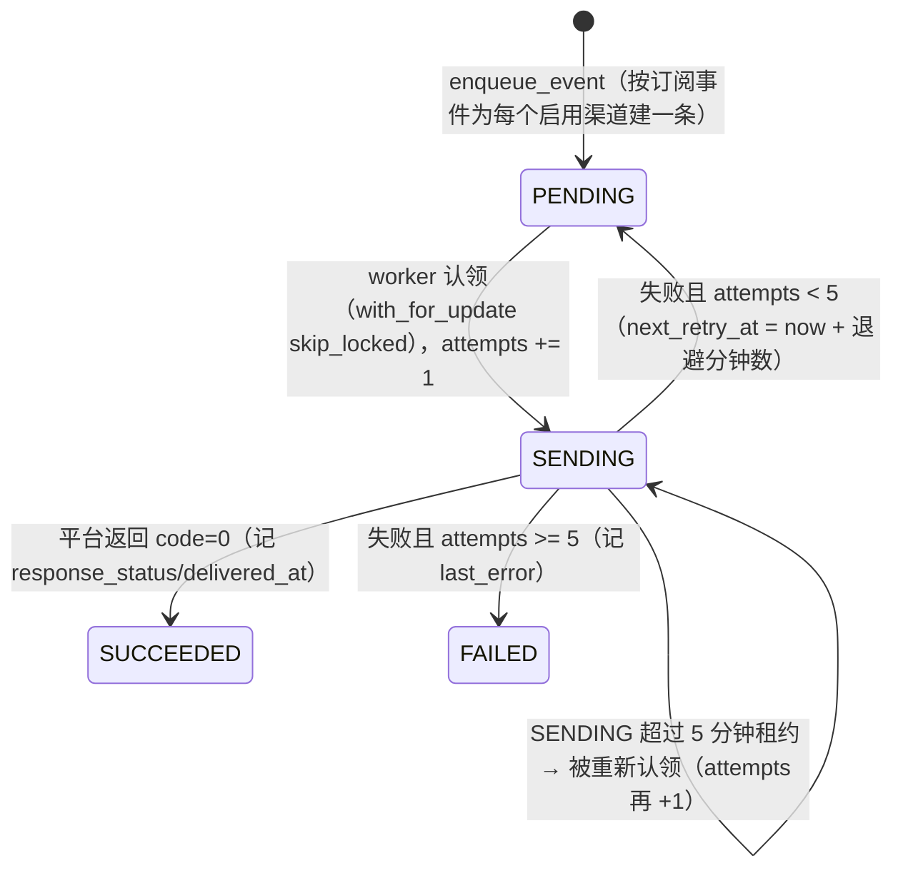

| 当前状态 | 动作 | 目标状态 | 说明 |
| --- | --- | --- | --- |
| `PENDING` 且 `next_retry_at <= now` | worker 轮询（每 2 秒） | `SENDING` | 每次只处理 1 条，处理成功立即继续下一条 |
| `SENDING` 且 `updated_at <= now-5min` | 同上 | `SENDING` | 进程崩溃后由租约超时恢复，无需重启清理 |
| `SENDING` | 平台 HTTP 非 2xx 或返回非 0 业务码 | `PENDING` / `FAILED` | 退避 `1/5/15/60/180` 分钟（第 n 次失败用 `_RETRY_MINUTES[n-1]`），第 5 次失败置 `FAILED` |
| `SUCCEEDED` / `FAILED` | 任意 | 终态 | 无重试入口；渠道配置变更不影响已入队投递 |

渠道配置（`webhook_channel`）本身的状态规则：

| 当前状态 | 动作 | 结果 | 错误码 |
| --- | --- | --- | --- |
| 不存在 | `PUT /system-settings/webhooks/{platform}` | 新建渠道行（`version` 从 1 开始） | 传入 `version` 与库中不一致 `409 VERSION_CONFLICT` |
| 任意 | 启用（`enabled=true`）但未填地址 | 拒绝 | `422 WEBHOOK_URL_REQUIRED` |
| 任意 | 启用但未选事件 | 拒绝 | `422 WEBHOOK_EVENTS_REQUIRED` |
| 任意 | 地址非 https 或域名/路径不匹配平台 | 拒绝 | `422 INVALID_WEBHOOK_URL` |
| 任意 | 密钥密文无法解密 | 读取/投递拒绝 | `503 WEBHOOK_CREDENTIAL_DECRYPT_FAILED` |
| 任意 | `POST .../webhooks/{platform}/test` 推送失败 | 不变 | `502 WEBHOOK_TEST_FAILED` |

</TabsContent>

<TabsContent id="t3">

### 9. 小程序状态与功能模式

#### 9.1 小程序用户

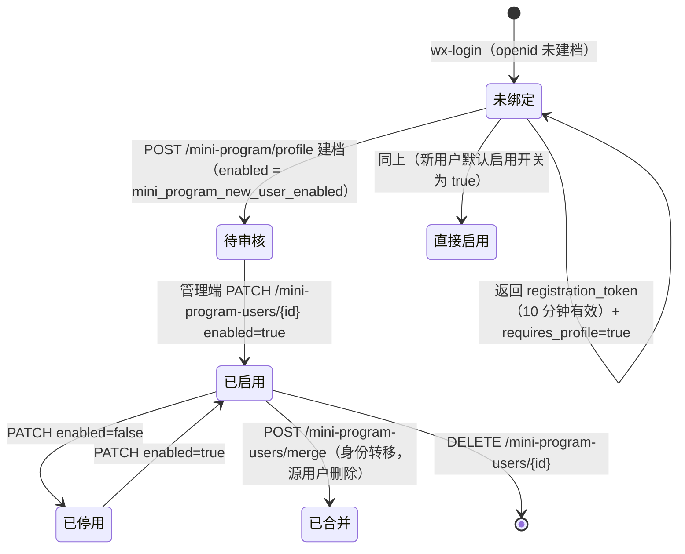

| 当前状态 | 动作 | 目标状态 | 错误码 |
| --- | --- | --- | --- |
| 未绑定 | `wx-login`，但注册开关关闭 | 拒绝 | `403 MINI_PROGRAM_REGISTRATION_DISABLED` |
| 待审核 | 带小程序 token 调任意小程序接口 | 拒绝 | `403 ACCOUNT_DISABLED`（“您的账号待审核”） |
| 待审核 | `POST /mini-program/profile`（重复建档） | 拒绝 | `403 ACCOUNT_DISABLED` |
| 已停用 | 重新 `wx-login` | 拒绝 | `403 ACCOUNT_DISABLED` |
| 任意 | `merge` 源=目标 | 拒绝 | `409 MINI_PROGRAM_USER_MERGE_SAME_ACCOUNT` |
| 任意 | 微信换码失败/服务不可用 | 不变 | `401 WECHAT_AUTH_FAILED` / `503 WECHAT_AUTH_UNAVAILABLE` |

#### 9.2 功能模式（`MiniProgramFeatureMode`）

配置存在 `system_setting` 的 `ai_search_config` 里，超管在 `/settings/advanced` 修改，小程序启动时拉取
（`GET /system-settings/mini-program-features`）；拉取失败时前端 `DEFAULT_MODES` 兜底。

| 配置项 | 默认值 | `disabled` | `query_only` | `read_write` |
| --- | --- | --- | --- | --- |
| `inventory_mode`（二级库库存） | `read_write` | 隐藏入口 | 只读 | 可扫码出库 |
| `huaxing_inventory_mode` | `query_only` | 隐藏入口 | 只读 | —（默认只读） |
| `purchase_plans_mode` | `query_only` | 隐藏入口 | 只读 | — |
| `purchase_records_mode` | `query_only` | 隐藏入口 | 只读 | — |
| `material_codes_mode` | `query_only` | 隐藏入口 | 只读 | — |

#### 9.3 二级库运行模式（`SecondaryWarehouseMode`）

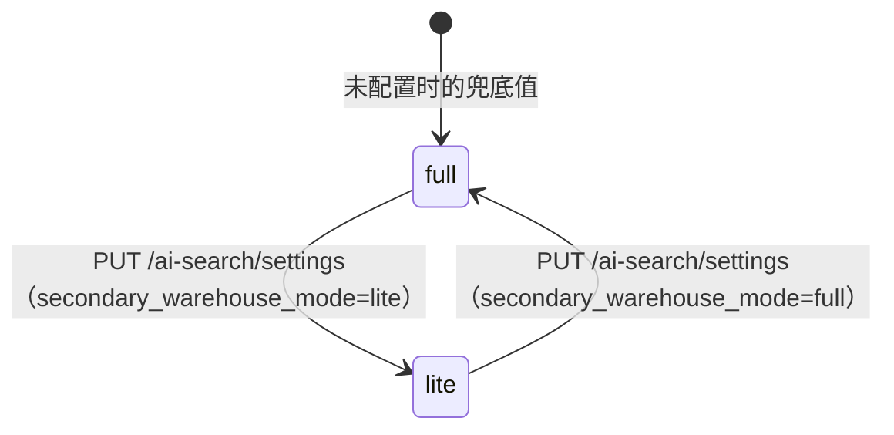

| 当前模式 | 动作 | 结果 | 错误码 |
| --- | --- | --- | --- |
| `lite` | 调完整模式写接口（入库/出库/改流水/冲销/物资增删改/安全库存） | 拒绝 | `403 SECONDARY_WAREHOUSE_LITE_MODE`（`api/deps._require_full_secondary_warehouse`） |
| `lite` | 小程序出库、出库原因、出库结果查询 | 拒绝 | `403 OUTBOUND_DISABLED`（`mini_program_service._ensure_not_lite_secondary_warehouse`） |
| `lite` | 精简库存列表 / 导入 / 最后导入时间 | 允许 | — |
| `lite` | 工作台统计 | 物资数取 `lite_inventory` 行数，低库存恒为 0 | — |
| `full` | 精简单页接口 | 仍可访问（仅数据为空） | — |

模式切换无流转校验，仅 `version` 乐观锁（`409 VERSION_CONFLICT`），并由超管在高级设置里显式保存；
前端在保存后强制刷新页面以立即切换菜单与路由。

#### 9.4 小程序码环境（`MiniProgramCodeEnv`）

`trial` / `release` 二选一，存在同一份配置里；`GET /stock-materials/mini-program-codes/{uuid}` 需显式传
`env` 与 `appid`，未配置的 AppID 报 `400 MINI_PROGRAM_APP_NOT_CONFIGURED`，微信侧失败报
`502 WECHAT_MINI_PROGRAM_CODE_FAILED`。

### 10. 分享链接生命周期

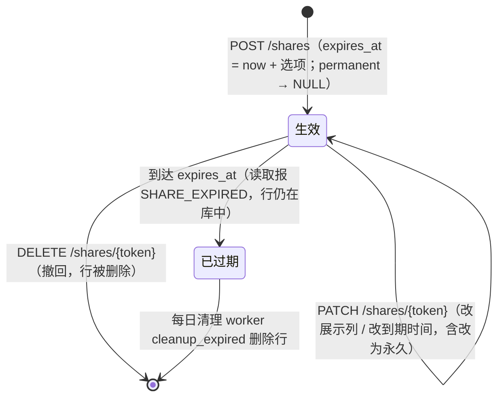

| 当前状态 | 动作 | 结果 | 错误码 |
| --- | --- | --- | --- |
| 不存在 | `GET /shares/{token}` | 拒绝 | `400 SHARE_NOT_FOUND` |
| 已过期 | `GET /shares/{token}` | 拒绝 | `400 SHARE_EXPIRED` |
| 生效 | `PATCH` / `DELETE`，非创建者且非超管 | 拒绝 | `403 FORBIDDEN` |
| 生效 | `PATCH columns` 含该类型不支持的列 | 拒绝 | `422 VALIDATION_ERROR`（消息列出非法列名） |
| 创建时 | 勾选项含不存在的计划/记录 id | 拒绝 | `400 NOT_FOUND` |

`columns = NULL` 表示默认展示列（该类型的全部列去掉「状态」）；`unit_name` 始终随行下发用于渲染数量单位。

</TabsContent>

<TabsContent id="t4">

### 11. 非法流转/状态相关错误码总表

| 错误码 | HTTP | 触发状态/场景 | 抛出位置 |
| --- | --- | --- | --- |
| `INVALID_STATUS_TRANSITION` | 409 | **当前无调用点**（`errors.invalid_transition` 已定义未使用） | `server/app/core/errors.py` |
| `VERSION_CONFLICT` | 409 | 乐观锁版本不符（`If-Match` 或 body `version`） | `common.validate_version`、webhook/AI 设置 |
| `MATERIAL_CODE_REQUIRED` | 409 | 未编码计划转申购记录 | `purchase_request_service.move_plans_to_record` |
| `PLAN_ALREADY_MOVED` | 409 | 计划已转入 | 同上 |
| `PURCHASE_PLAN_IN_USE` | 409 | 删除已转入的计划 | `material_service.delete_purchase_material` |
| `STOCK_MATERIAL_IN_USE` | 409 | 删除有流水记录的二级库物资 | `material_service.delete_stock_material` |
| `PLAN_DAILY_LIMIT_EXCEEDED` | 409 | 同一计划日期已生成 999 条 | `material_service.next_purchase_plan_no` |
| `PLAN_NO_CONFLICT` | 409 | 保存点重试 3 次仍撞号 | `material_service.create_purchase_material` |
| `ARCHIVED_PURCHASE_PLAN_FORBIDDEN` | 403 | 非超管查询/打开/导出已归档计划 | `api/v1/purchase_materials.py` |
| `NOT_LOW_STOCK` | 409 | 对非低库存物资发起补库 | `replenishment_service.create_replenishment_draft` |
| `BALANCE_MISSING` | 409 | 库存余额行缺失 | `inventory_service._lock_and_validate_materials` |
| `INVALID_SOURCE_TYPE` | 400 | 来源类型与收发/调用方式不符 | `inventory_service._validate_operation_semantics` 等 |
| `INVALID_REVERSAL_LINE` | 400 | 冲销行不属于原流水 | `inventory_service.create_operation` |
| `INSUFFICIENT_QUANTITY` | 409 | 冲销数量超过 `remaining_qty` | 同上 |
| `RECEIVER_REQUIRED` | 400 | 出库未填领用人 | `_validate_operation_semantics` |
| `INVALID_RECEIVER` / `INVALID_RECEIVER_UNIT` | 400 | 入库填写了领用人/单位 | 同上 |
| `BUSINESS_REASON_REQUIRED` | 400 | 出库未填用途 | `inventory_service.create_operation` |
| `INVALID_QUANTITY_PRECISION` | 400 | 数量超过 1 位小数 | `common.validate_quantity_precision` |
| `CLIENT_REQUEST_ID_CONFLICT` | 409 | 小程序复用 `client_request_id` 但物资不符 | `mini_program_service._outbound_read` |
| `IMPORT_IN_PROGRESS` | 409 | 同类导入任务进行中 | `import_job_service.enqueue_import` |
| `EXPORT_FILE_EXPIRED` | 400 | 导出文件已过期/不存在 | `excel_export_job_service.get_export_file_by_uuid` |
| `EXPORT_RESULT_LIMIT_EXCEEDED` | 400 | 导出行数超过 10000 | `api/v1/purchase_requests.py` |
| `SECONDARY_WAREHOUSE_LITE_MODE` | 403 | 精简模式下调完整模式写接口 | `api/deps._require_full_secondary_warehouse` |
| `OUTBOUND_DISABLED` | 403 | 精简模式下小程序出库 | `mini_program_service` |
| `ACCOUNT_DISABLED` | 403 | 小程序用户待审核/停用 | `permissions.get_current_mini_program_user` |
| `MINI_PROGRAM_REGISTRATION_DISABLED` | 403 | 新用户注册已关闭 | `mini_program_service.login_with_wechat` |
| `SHARE_NOT_FOUND` / `SHARE_EXPIRED` | 400 | 分享 token 不存在 / 已过期 | `share_link_service.get_public_share` |
| `FORBIDDEN` | 403 | 角色不足或非属主操作 | `permissions.require_roles`、分享/导出属主校验 |
| `NOT_FOUND` | 400 | 按 id 查询的任意资源不存在 | 34 处 `not_found(...)` 调用 |
| `ROUTE_NOT_FOUND` | 400 | 未匹配的 API 路径（框架级 404 重映射） | `exception_handlers.handle_http_exception` |
| `DATA_CONFLICT` | 409 | 数据库唯一约束/完整性冲突 | `exception_handlers.handle_integrity_error` |

接口与错误体结构约定见 [/api-error-conventions](/api-error-conventions)；各枚举与表的落库细节见
[/dev-data-model](/dev-data-model)；这些状态在请求链路中的时序见 [/dev-flows](/dev-flows)。

</TabsContent>

</Tabs>
